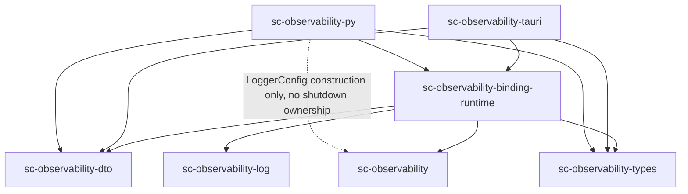

# SC-Observability Architecture

**Status**: Approved baseline; ADR-011–ADR-016 Accepted; ADR-017–ADR-019
Accepted for Phase D
**Applies to**: `sc-observability-types`, `sc-observability`, `sc-observe`, `sc-observability-otlp`
**Related documents**:
- [`requirements.md`](./requirements.md)
- [`api-design.md`](./api-design.md)
- [`atm-quickstart.md`](./atm-quickstart.md)
- [`atm-adapter-requirements.md`](./atm-adapter-requirements.md)
- [`atm-adapter-architecture.md`](./atm-adapter-architecture.md)

## 1. System Overview

The workspace is a layered stack, not a monolith:

```text
sc-observability-types
  shared neutral contracts only
          |
sc-observability
  lightweight logging only
          |
sc-observe
  observation routing / pub-sub / projection
          |
sc-observability-otlp
  OpenTelemetry / OTLP integration
```

The critical architectural rule is that each layer can be understood in
isolation:

- the types layer does not know about logging, routing, or OTLP behavior
- the logging layer does not know about routing or OTLP behavior
- the routing layer depends on logging but not on OTLP
- the OTLP layer builds on the lower-level infrastructure and owns all OTel
  transport concerns

## 1.1 Approval Scope

```text
APPROVED for shared-repo boundary direction / blocker closure.
NOT YET sufficient as the complete ATM migration specification.
```

The shared workspace architecture is approved when the crate boundaries,
dependency layering, and generic extension points are correct. Complete ATM
migration confidence additionally requires the ATM adapter requirements and ATM
adapter architecture documents that define the compatibility behavior outside
this repo.

## 2. Architectural Principles

- Preserve linear layering.
- Keep `sc-observability` lightweight and self-contained.
- Keep `sc-observe` generic over downstream integrations.
- Keep OpenTelemetry concerns only in `sc-observability-otlp`.
- Keep shared contracts in `sc-observability-types` neutral and ATM-free.
- Prevent higher-layer requirements from leaking downward.

## 3. Per-Crate Architecture

### 3.1 `sc-observability-types`

This crate is the shared contract layer.

Owns:

- `ErrorCode`, `Diagnostic`, `Remediation`, `ErrorContext`
- `Timestamp`, `DurationMs`
- `TraceContext`, `TraceId`, `SpanId`
- `SpanRecord<S>`, `SpanSignal`, `MetricRecord`, `LogEvent`
- typed stable labels such as `CorrelationId`, `OutcomeLabel`, `SinkName`, and
  `MetricUnit`
- `ObservabilityHealthProvider`
- `LogQuery`, `LogOrder`, `LogFieldMatch`
- `LogSnapshot`, `QueryError`, `QueryHealthState`, `QueryHealthReport`
- `MaintenanceHealthReport`, `MaintenanceWorkerState`, `WriterState`
- health report contracts
- shared open traits such as `Observable`, subscribers, filters, and projectors
- the published sealed `DiagnosticInfo` diagnostic contract

Must not own:

- sinks
- concrete logging runtime behavior such as `Logger`, `LoggerBuilder`,
  `LogSink`, `SinkRegistration`, or built-in sink implementations
- routing runtime behavior
- OTLP exporters or OpenTelemetry dependencies
- application-specific observation payloads

Malformed deserialized `SpanRecord<SpanEnded>` values are tolerated at
read/interop boundaries only. Producer-facing APIs still require a valid
ended span, while `duration_ms()` returns `None` for malformed
deserialize-only records instead of panicking.

Important boundary:

- this crate is neutral shared vocabulary, not a behavior layer

### 3.2 `sc-observability`

This crate is the lightweight logging layer.

Owns:

- `Logger`
- `LoggerConfig`
- retained-log maintenance policy and queue-backed writer runtime (see §3.2.1)
- `LoggerBuilder`
- `LogSink`
- `SinkRegistration`
- `JsonlFileSink`
- `ConsoleSink`
- redaction
- rotation
- `LoggingHealthReport`, `MaintenanceHealthReport`, `MaintenanceWorkerState`,
  `WriterState`, `SinkHealth`, and `SinkHealthState` defined in
  `sc-observability-types`, re-exported by `sc-observability`

Runtime role:

- validate and redact `LogEvent`
- fan out to local sinks
- record sink-local health and drop behavior
- expose crate-local logging injection traits implemented by `Logger`

Must not own:

- observation routing
- subscriber registries
- OTLP transport
- OpenTelemetry dependencies

This crate must remain usable on its own by a basic CLI.

### 3.2.1 Retained-Log Maintenance

Retained-log lifecycle management belongs to `sc-observability`, not to
downstream application wrappers.

Owns:

- `RetainedLogPolicy` struct nested in `LoggerConfig`
- `rotation_max_bytes`, `rotation_max_files`, and `retention_max_age`
- `maintenance_cadence`, `writer_shutdown_timeout`, and
  `maintenance_max_work_per_pass`
- writer-thread-owned maintenance lifecycle
- maintenance health reporting and bounded writer-thread shutdown-drain behavior

Approved architecture shape:

- the logging layer owns one queue-backed writer thread that admits validated
  log events from producer calls and owns batching, sink writes, rotation,
  pruning, flush, and shutdown drain
- maintenance runs on the writer thread during idle or post-batch windows
- producer calls validate, redact, and enqueue events; they do not perform
  built-in file-sink writes directly
- the writer thread is created, supervised, and joined entirely by
  `sc-observability`; downstream apps do not manage it directly
- a writer-thread maintenance pass may rotate the active file, prune excess
  retained files, prune stale retained files, and update maintenance health
  state
- bounded per-pass work exists so a single maintenance sweep cannot grow
  without limit

Health and shutdown contract:

- retained-log maintenance health belongs on the logging health surface
- health must capture the last maintenance pass timestamp, rotated/pruned
  totals, last maintenance error, and worker state
- `MaintenanceWorkerState` is owned by `sc-observability-types` with variants
  `Running`, `Degraded`, and `Stopped`
- `LoggingHealthReport` also carries queue depth, queue capacity,
  queue high-water mark, queue-full drop totals, writer state, and last writer
  error so downstream health/doctor commands can diagnose saturation
- maintenance failures are fail-open and do not stop logging
- `Logger::shutdown()` drains queued events and does not return until the
  writer thread has definitively joined
- if the shutdown timeout threshold is exceeded, shutdown records degraded
  state and then continues waiting for definitive writer completion

Layering rules:

- `sc-observability` owns the queue-backed writer runtime and the concrete
  retained-log policy surface
- `sc-observability-types` may own shared health-report types only if those
  types must cross crate boundaries
- `sc-observe` and `sc-observability-otlp` consume the resulting logging
  behavior but do not own retained-log maintenance
- ATM-specific wrappers may choose policy values, but they do not own the
  generic maintenance machinery

### 3.2.2 `sc-compose` Logging-Only Integration Contract

`sc-compose` is the reference logging-only downstream consumer for this crate.
Its architecture stays intentionally split:

- `sc-composer` keeps its own local observer/event layer
- `sc-compose` owns the adapter from that local layer into
  `sc-observability::Logger`
- `sc-composer` does not depend directly on `sc-observability-types`
- this contract is intentionally limited to simple logging-only integration;
  `sc-observe` and `sc-observability-otlp` are out of scope

The consumer-facing split is:

- `sc-observability-types` provides neutral contracts such as `LogEvent`,
  diagnostics, identifiers, `LoggingHealthReport`,
  `MaintenanceHealthReport`, `MaintenanceWorkerState`, `SinkHealth`,
  `SinkHealthState`, `QueryHealthReport`, and `QueryHealthState`
- `sc-observability` provides the concrete logging runtime surface:
  `Logger`, `LoggerConfig`, `LoggerBuilder`, `LogSink`, `SinkRegistration`,
  `ConsoleSink`, `JsonlFileSink`, `Logger::health()`, and
  `Logger::shutdown()`
- the adapter that translates `sc-composer` observer callbacks into `LogEvent`
  records belongs to `sc-compose`, not to this workspace

For this integration path, `LogEvent.service` is the configured CLI service
identity owned by `sc-compose`, while the remaining record fields are derived
from the local observer event being adapted.

Event sources for the adapter are:

- CLI-owned command lifecycle hooks in `sc-compose`
- the local `sc_composer::observer` callbacks emitted by composition work

Command lifecycle events are emitted directly by `sc-compose` around command
dispatch. They do not require additional callbacks from `sc-composer`.

For contract purposes, the local `sc-composer` observer surface must remain
object-safe and `dyn`-compatible, and must be sufficient for the CLI adapter to
translate composition events into `LogEvent` records. The minimum approved
shape is:

```rust
pub enum ObservationEvent {
    ResolveAttempt(ResolveAttemptEvent),
    ResolveOutcome(ResolveOutcomeEvent),
    IncludeExpandOutcome(IncludeOutcomeEvent),
    ValidationOutcome(ValidationOutcomeEvent),
    RenderOutcome(RenderOutcomeEvent),
}

pub trait ObservationSink {
    fn emit(&mut self, event: &ObservationEvent);
}

pub trait CompositionObserver {
    fn on_resolve_attempt(&mut self, event: &ResolveAttemptEvent) {}
    fn on_resolve_outcome(&mut self, event: &ResolveOutcomeEvent) {}
    fn on_include_outcome(&mut self, event: &IncludeOutcomeEvent) {}
    fn on_validation_outcome(&mut self, event: &ValidationOutcomeEvent) {}
    fn on_render_outcome(&mut self, event: &RenderOutcomeEvent) {}
}

pub fn compose_with_observer(
    request: &ComposeRequest,
    observer: &mut dyn CompositionObserver,
) -> Result<ComposeResult, ComposeError>;
```

The exact downstream type names may evolve, but the observer contract must keep
the same three properties:

- a local `ObservationEvent`-style composition event enum
- an object-safe sink/observer interface callable through `&mut dyn ...`
- `compose_with_observer(...)` as the end-to-end injection surface

Approved `sc-compose` wiring shape:

1. `sc-compose` constructs `LoggerConfig` and `Logger` during CLI startup.
2. Human-readable command execution may enable the built-in console sink in
   addition to the file sink.
3. Commands that emit machine-readable `--json` output disable the built-in
   console sink so stdout remains valid command output.
4. The `sc-compose observability-health` subcommand reads `Logger::health()`
   and returns the resulting `LoggingHealthReport`.
5. If the CLI does not install a logger-backed adapter, `sc-composer`
   continues to use its built-in no-op observer path and command behavior
   remains functional with logging disabled.
6. CLI shutdown calls `Logger::shutdown()` so registered sinks flush before
   exit.

The adapter-owned event mapping is:

| `sc-compose` event source | `LogEvent.target` | `LogEvent.action` | `LogEvent.message` | Other `LogEvent` fields |
| --- | --- | --- | --- | --- |
| command start | `compose.command` | `started` | human-readable summary such as `render started` | `fields` include command name and relevant mode flags |
| command end, success | `compose.command` | `completed` | human-readable summary such as `render completed` | `fields` include command name, elapsed time, and output mode; `outcome` is success |
| command end, failure | `compose.command` | `failed` | human-readable summary such as `render failed` | `fields` include command name, exit code, elapsed time, and output mode; `outcome` is failure; `diagnostic` is attached when available |
| resolve attempt or outcome | `compose.resolve` | phase-specific action such as `attempt`, `resolved`, or `failed` | concise resolver summary sentence | `outcome` reflects success/failure; `diagnostic` is attached for failures; resolver traces or selected paths live in `fields` |
| include-expand outcome | `compose.include_expand` | phase-specific action such as `expanded` or `failed` | concise include-expansion summary sentence | include stack and path details live in `fields`; failures attach `diagnostic` |
| validation outcome | `compose.validate` | phase-specific action such as `completed` or `failed` | concise validation summary sentence | validation counts and policy decisions live in `fields`; failures attach `diagnostic` |
| render outcome | `compose.render` | phase-specific action such as `completed` or `failed` | concise render summary sentence | render metadata lives in `fields`; `outcome` and `diagnostic` reflect success/failure |

This mapping is intentionally adapter-owned so `sc-observability` preserves a
generic logging contract and does not absorb `sc-compose`-specific event
taxonomies.

### 3.2.3 Consumer Usability Follow-Ups

The remaining consumer-facing logging-surface follow-ups stay in
`sc-observability` and do not move into `sc-observe` or
`sc-observability-otlp`.

- the default active JSONL path becomes
  `<log_root>/logs/<service>.log.jsonl`
  - approved simplification note: the older nested layout
    `<log_root>/<service>/logs/<service>.log.jsonl` was dropped so operators
    manage one stable `logs/` subtree per configured root instead of
    duplicating the service segment in both the directory tree and filename
- `ConsoleSink` keeps a small public writer-selection surface:
  `ConsoleSink::stdout()` and `ConsoleSink::stderr()` are public, while
  arbitrary writer injection remains non-public
- retained-sink fault injection lives in the retained-sink layer, not in the
  query/follow layer, and is exposed only through a deliberate validation-only
  surface such as `#[cfg(test)]` or a `fault-injection` feature
- consumer-facing onboarding artifacts (`README.md`, `CONSUMING.md`, and
  `examples/custom-sink-example/`) document and validate the public logging
  surface without relying on workspace-internal APIs
- `examples/custom-sink-example/` must compile against the public API only so
  it continuously proves that the shipped sink extension points are sufficient
  for downstream consumers

### 3.2.4 Query And Follow Extension

The query/follow feature remains part of the logging layer. It does not move
into `sc-observe`, does not depend on `sc-observability-otlp`, and does not
require an async runtime.

Type ownership is split as follows:

- `sc-observability-types` owns `LogQuery`, `LogOrder`,
  `LogFieldMatch`, `LogSnapshot`, `QueryError`,
  `QueryHealthState`, `QueryHealthReport`, `MaintenanceHealthReport`,
  `MaintenanceWorkerState`, `WriterState`, and
  `ObservabilityHealthProvider`
- `sc-observability-types` extends `LoggingHealthReport` with
  `flush_errors_total`, `queue_depth`, `queue_capacity`,
  `queue_high_water_mark`, `queue_full_drops_total`, `writer_state`,
  `last_writer_error`, `query: Option<QueryHealthReport>`, and
  `maintenance: Option<MaintenanceHealthReport>`
- `sc-observability` owns `Logger::query`, `Logger::follow`,
  `LogFollowSession`, and `JsonlLogReader`

Approved public API surface for this sprint:

```rust
pub enum LogOrder {
    OldestFirst,
    NewestFirst,
}

pub struct LogFieldMatch {
    pub field: String,
    pub value: serde_json::Value,
}

pub struct LogQuery {
    pub service: Option<ServiceName>,
    pub levels: Vec<Level>,
    pub target: Option<TargetCategory>,
    pub action: Option<ActionName>,
    pub request_id: Option<CorrelationId>,
    pub correlation_id: Option<CorrelationId>,
    pub since: Option<Timestamp>,
    pub until: Option<Timestamp>,
    pub field_matches: Vec<LogFieldMatch>,
    pub limit: Option<usize>,
    pub order: LogOrder,
}

pub struct LogSnapshot {
    pub events: Vec<LogEvent>,
    pub truncated: bool,
}

pub enum QueryError {
    InvalidQuery(Box<ErrorContext>),
    Io(Box<ErrorContext>),
    Decode(Box<ErrorContext>),
    Unavailable(Box<ErrorContext>),
    Shutdown,
}

pub enum QueryHealthState {
    Healthy,
    Degraded,
    Unavailable,
}

pub struct QueryHealthReport {
    pub state: QueryHealthState,
    pub last_error: Option<DiagnosticSummary>,
}

pub enum MaintenanceWorkerState {
    Running,
    Degraded,
    Stopped,
}

pub struct MaintenanceHealthReport {
    pub state: MaintenanceWorkerState,
    pub last_pass_at: Option<Timestamp>,
    pub rotated_files_total: FileCount,
    pub pruned_files_total: FileCount,
    pub last_error: Option<DiagnosticSummary>,
}

pub struct LoggingHealthReport {
    pub state: LoggingHealthState,
    pub dropped_events_total: u64,
    pub flush_errors_total: u64,
    pub active_log_path: std::path::PathBuf,
    pub sink_statuses: Vec<SinkHealth>,
    pub queue_depth: u64,
    pub queue_capacity: u64,
    pub queue_high_water_mark: u64,
    pub queue_full_drops_total: u64,
    pub writer_state: WriterState,
    pub last_writer_error: Option<DiagnosticSummary>,
    pub query: Option<QueryHealthReport>,
    pub maintenance: Option<MaintenanceHealthReport>,
    pub last_error: Option<DiagnosticSummary>,
}

pub enum WriterState {
    Running,
    Degraded,
    Stopped,
}

pub trait ObservabilityHealthProvider: telemetry_health_provider_sealed::Sealed + Send + Sync {
    fn telemetry_health(&self) -> TelemetryHealthReport;
}

impl Logger<Running> {
    pub fn query(&self, query: &LogQuery) -> Result<LogSnapshot, QueryError>;
    pub fn follow(&self, query: LogQuery) -> Result<LogFollowSession, QueryError>;
}

pub struct LogFollowSession {
    /* opaque */
}

impl LogFollowSession {
    pub fn poll(&mut self) -> Result<LogSnapshot, QueryError>;
    pub fn health(&self) -> QueryHealthReport;
}

pub struct JsonlLogReader {
    /* opaque */
}

impl JsonlLogReader {
    pub fn new(active_log_path: std::path::PathBuf) -> Self;
    pub fn query(&self, query: &LogQuery) -> Result<LogSnapshot, QueryError>;
    pub fn follow(&self, query: LogQuery) -> Result<LogFollowSession, QueryError>;
}
```

`flush_errors_total` remains part of `LoggingHealthReport` in the writer-thread
model so flush-failure accounting stays visible even after queue and writer
health fields are added.

`QueryError` is backed by the stable error-code constants
`SC_LOG_QUERY_INVALID_QUERY`, `SC_LOG_QUERY_IO`, `SC_LOG_QUERY_DECODE`,
`SC_LOG_QUERY_UNAVAILABLE`, and `SC_LOG_QUERY_SHUTDOWN` per `requirements.md`
TYP-036.

Behavioral boundaries:

- `Logger::query` and `Logger::follow` are convenience entry points over the
  logger's active JSONL path and documented rotation layout
- `JsonlLogReader` is reusable by tools that need offline inspection without a
  live logger instance
- `LogFollowSession` stays synchronous and caller-driven: no runtime-managed
  background work, async executor, or socket-style streaming surface
- logger-created `LogFollowSession` instances become unavailable once the
  owning `Logger` shuts down; `JsonlLogReader` sessions remain independent
- `QueryError` stays in `sc-observability-types` so all logging query surfaces
  share one stable error vocabulary

### 3.3 `sc-observe`

This crate is the observation runtime layered on top of logging.

Owns:

- `Observability`
- `ObservabilityBuilder`
- `ObservabilityConfig`
- subscriber registration
- projector registration
- observation routing and fan-out
- `ObservabilityHealthReport` and `ObservationHealthState` defined in
  `sc-observability-types`, re-exported by `sc-observe`

Runtime role:

- accept `Observation<T>`
- route to typed subscribers
- project to `LogEvent`, `SpanSignal`, and `MetricRecord`
- send logs into the logging layer
- expose generic downstream extension points for higher-layer integrations
- expose crate-local observation injection traits implemented by
  `Observability`

Must not own:

- OpenTelemetry transport or OTel-specific configuration
- direct dependency on `sc-observability-otlp`
- application-specific payload taxonomies

The key point is that `sc-observe` is a routing/runtime layer, not an OTLP
layer.

### 3.4 `sc-observability-otlp`

This crate is the top-of-stack OpenTelemetry layer.

Owns:

- `Telemetry`
- `TelemetryConfig`
- `OtelConfig`
- `OtlpProtocol`
- `SpanAssembler`
- `CompleteSpan`
- internal OTLP exporter contracts used by the runtime implementation
- OTLP batching, retry, timeout, flush, and shutdown
- `TelemetryHealthReport`, `ExporterHealth`, and `ExporterHealthState` defined
  in `sc-observability-types`, re-exported by `sc-observability-otlp`

Runtime role:

- consume lower-layer projected logs, spans, and metrics
- assemble span lifecycle signals into completed exportable spans
- invoke actual OpenTelemetry/OTLP services and transports
- expose crate-local telemetry signal injection traits implemented by
  `Telemetry`

Configuration model:

- `TelemetryConfig` is constructed and owned by the application layer
- `TelemetryConfig` is passed directly to `sc-observability-otlp`
- `TelemetryConfig` is not embedded in or derived from `ObservabilityConfig`

Must not push OTLP concerns into the lower crates.

## 4. Runtime Composition

The layered design supports three normal application shapes.

### 4.1 Logging Only

```text
application -> sc-observability
```

Use when a CLI or tool needs structured logging only.

The query/follow API is part of this shape. An application may use `Logger`,
`Logger::query`, `Logger::follow`, or `JsonlLogReader` without enabling
`sc-observe` or `sc-observability-otlp`.

For `sc-compose`, this shape is:

```text
sc-composer local observer layer -> sc-compose adapter -> sc-observability::Logger
```

The important boundary is that `sc-compose` depends on `sc-observability` for
concrete logger behavior, while `sc-composer` remains independent from
`sc-observability-types` and keeps its local observer API.

### 4.2 Logging + Routing

```text
application -> sc-observe -> sc-observability
```

Use when one observation should fan out to logs and typed subscribers without
any OTLP dependency.

### 4.3 Full Stack

```text
application -> sc-observability-otlp
                    |
                    v
               sc-observe
                    |
                    v
              sc-observability
```

Use when the application needs OTel export in addition to routing and logging.

### 4.4 ATM-Shaped Baseline

The shared stack's ATM-shaped out-of-the-box behavior and minimal production
configuration are documented separately in [`atm-quickstart.md`](./atm-quickstart.md).

That document is part of the shared-repo detailed design because ATM is the
first sophisticated adopter, but it does not move ATM-owned compatibility
behavior into the shared crates.

### 4.5 Rotation-Aware Query/Follow

Historical query and follow behavior operate on one logical log stream made
from:

- the active path `<log_root>/logs/<service>.log.jsonl`
- rotated siblings using the existing `.N` suffix convention

Historical query strategy:

- resolve the active file and its rotated siblings once at query start
- treat that resolved set as a point-in-time snapshot for the duration of the
  query
- scan in oldest-to-newest order for `LogOrder::OldestFirst` and in reverse for
  `LogOrder::NewestFirst`
- apply filtering before limit truncation and report truncation through
  `LogSnapshot.truncated`
- surface malformed JSONL records or contract decode failures as
  `QueryError::Decode` rather than silently dropping them

Follow strategy:

- follow sessions begin at the tail of the currently visible log set and do not
  replay historical backlog; callers needing backlog plus tail must call
  `query()` first
- `LogFollowSession` tracks the active path, file identity, and current read
  offset
- `poll()` reads appended records since the last successful poll
- if the active file shrinks or its file identity changes, the session treats
  that as rotation/truncation, reopens the new active file, and resumes from
  offset `0`
- Unix-family platforms use `(dev, ino)` metadata, and Windows uses stable
  Win32 handle metadata via `GetFileInformationByHandle`
- non-Unix, non-Windows targets still rely on `(len, modified_nanos)` as the
  documented fallback identity
- the follow path remains poll-based and caller-driven; no async watch service
  is introduced

Validation:

- `limit = Some(0)` is invalid and returns `QueryError::InvalidQuery`
- `since > until` is invalid and returns `QueryError::InvalidQuery`
- `field_matches` use exact field-name lookup and exact JSON value equality

This strategy keeps the logging layer self-contained while still making
rotation behavior explicit enough for implementation and QA.

## 5. Producer Wiring

Producer code should be wired at the highest layer it needs:

- logging-only producers inject `Logger` or a narrow logging handle
- routing-aware producers inject `Observability`
- OTel-enabled producers compose the OTLP layer on top of `sc-observe`

The important ownership rule is:

- producers emit one canonical observation
- lower layers do not require knowledge of higher-layer transports

### 5.1 Full-Stack Attachment Model

Under the corrected layering, `sc-observability-otlp` attaches to
`sc-observe` by using the existing open projector extension points.

The attachment model is:

1. the application constructs `ObservabilityBuilder` for `sc-observe`
2. the application constructs `TelemetryConfig` independently for
   `sc-observability-otlp`
3. `sc-observability-otlp` registers its `LogProjector`, `SpanProjector`, and
   `MetricProjector` implementations with `ObservabilityBuilder`
4. `sc-observe` remains generic and routes observations through those
   registrations like any other external projector

Important boundary:

- `sc-observe` does not provide a special internal OTLP handle
- `sc-observability-otlp` plugs in through the same registration model exposed
  to other downstream projector consumers

## 6. Crate Boundary Table

| Crate | Depends On | Must Not Depend On | Public Surface Summary |
| --- | --- | --- | --- |
| `sc-observability-types` | shared support crates only | `sc-observability`, `sc-observe`, `sc-observability-otlp`, `agent-team-mail-*` | shared contracts, typed identifiers, UTC timestamps, typed durations, diagnostics, shared traits including `ObservabilityHealthProvider`, health type definitions including `LoggingHealthReport`, `MaintenanceHealthReport`, `MaintenanceWorkerState`, and `WriterState`, and logging query/follow value and error contracts |
| `sc-observability` | `sc-observability-types` | `sc-observe`, `sc-observability-otlp`, `agent-team-mail-*` | lightweight logging, sinks, legacy direct rotation helpers, `RetainedLogPolicy`, queue-backed writer runtime, `Logger`, `JsonlLogReader`, follow session runtime, and logging health/maintenance re-exports including `MaintenanceHealthReport`, `MaintenanceWorkerState`, and `WriterState` |
| `sc-observe` | `sc-observability-types`, `sc-observability` | `sc-observability-otlp`, `agent-team-mail-*` | observation routing, subscribers, projectors, top-level health re-exports |
| `sc-observability-otlp` | `sc-observability-types`, `sc-observability` (`sc-observe` dev-only for integration tests) | `agent-team-mail-*` | OTel/OTLP transport, telemetry services, exporters, telemetry health re-exports |
| `sc-observability-log`† | `sc-observability`, `sc-observability-types`, `sc-observability-log-macros` (exact-pinned) | `sc-observe`, `sc-observability-otlp`, `agent-team-mail-*`, Tauri/Specta/PyO3 | `log`-facade bridge and tracing-compatible event/`#[instrument]` macros re-exports; `LogGuard`/`LogControl` lifecycle; `InitError`/`FlushError`/`ShutdownError`/`DetachError` are a scoped TYP-030 companion exception (PHB-002); B.1 mechanical copy, unpublished |
| `sc-observability-dto`† | `sc-observability-types`, `serde`, `serde_json`; optional exact-pinned Schemars tooling | core runtime, bridge, Tauri, PyO3, ownership capabilities | B.3 schema-v1 wire projections and checked conversions; scoped TYP-030 wire-only exception, no native type replacement |
| `sc-observability-log-macros`† | third-party proc-macro support only (`syn`, `quote`, `proc-macro2`) | `sc-observability-log` (no reverse dependency back to the bridge), `sc-observability`, `sc-observe`, `sc-observability-otlp`, `agent-team-mail-*` | procedural macro expansion only for `sc-observability-log`'s event/`#[instrument]` forms; no runtime types; B.1 mechanical copy, unpublished |
| `sc-observability-log-consumer-check`† | `sc-observability-log` only (direct path dependency) | `sc-observability-log-macros` (macro expansion is exercised only through the bridge, preserving the external macro-expansion hygiene check), `agent-team-mail-*` | CI-only compile-time proof that macro consumers need only the bridge dependency; never published |

† This crate's ADR-011 companion-boundary placement (including its TYP-030 companion/wire-only exception scoping above) is provisional pending ADR-011's formal acceptance — see ADR-011's own Status line below.

### Phase B Binding Runtime Edges

The shared native runtime provides core and bridge backends, bounded operations
and the unique core shutdown owner. `arc-swap` publishes immutable health and
logger references without an admission mutex; `serde_json` supports checked DTO
conversion. These support crates add no host/framework dependency. The resolved
workspace allowlist and aliased/target host edges are checked by
`scripts/ci/validate_binding_runtime_dependencies.py`.


B.3b structural/dependency CI enforces this exact set of workspace
edges for sc-observability-binding-runtime; third-party support crates retain
normal dependency review. Tauri and PyO3 may depend on the runtime, never the
reverse. This proposed diagram does not claim the crate is implemented.

`scripts/ci/validate_binding_runtime_dependencies.py` resolves and checks the
shared runtime manifest plus both consumer manifests. It includes ordinary,
build, dev, target-specific and aliased workspace declarations, so a renamed
workspace dependency cannot evade the first-party or forbidden-host policy.

Both binding crates also declare direct `sc-observability-dto` and
`sc-observability-types` dependencies, alongside their `Runtime` edge, not
instead of it. This is permitted: DTO and Types are the neutral, leaf-level
wire/contract crates plan-phase-b.md's binding architecture describes as
depending on "public types, not Tauri or PyO3" — any consumer, including a
binding crate, may take them directly without duplicating the Runtime's
responsibilities. `sc-observability-py` additionally depends directly on
`sc-observability` (core) itself, used only to construct a
`sc_observability::LoggerConfig` value from Python-supplied inputs
(`bindings/python/sc-observability-py/src/lib.rs`); it does not call, hold, or
otherwise duplicate the core logger's own lifecycle/shutdown ownership, which
the Runtime alone retains. No Tauri/PyO3-facing crate gains an independent
shutdown-owning edge to core through either dependency; the Runtime-only rule
is about lifecycle/shutdown ownership, not about every possible workspace
compile-time edge.



### Phase D transport allowlist

The OTLP dependency allowlist explicitly permits the feature-gated
`legacy-http-json` feature and its reviewed `reqwest`, `httpdate`, `getrandom`,
and Tokio `rt`/`sync` dependencies; obs-d-21 owns this normative declaration.
The legacy transport uses `reqwest =0.12.28` with `blocking`, `json`,
`rustls-tls` and default features off, and `httpdate =1.0.3`; its transitive
Tokio use does not impose a caller-owned runtime. The separate `otlp-sdk`
feature admits the reviewed `opentelemetry*` SDK family and its explicitly
reviewed transport dependencies only. obs-d-21 records exact remaining pins
in Cargo.lock and the existing boundaries manifest at implementation review.
No wildcard approval covers an unrelated dependency. ADR-019 records this
amendment to ADR-018; the existing boundary manifest is the single machine
allowlist and this section is its normative explanation.

## 6.1 Query/Follow Dependency Order

The implementation dependency order for the query/follow work is:

```text
#24 LogQuery
  -> #25 QueryError
    -> (#26 historical query, #27 follow/tail, #28 query health)
      -> #29 JsonlLogReader
```

Consequences:

- the contract and error vocabulary land before runtime behavior
- issues `#26`, `#27`, and `#28` may proceed in parallel once `#24` and `#25`
  are merged
- `#29` finalizes the standalone reader after the logger-facing API and health
  behavior are already fixed
- the public signatures above must remain stable across that sequence

## 7. ADRs

ADR navigation index (status is recorded in each decision below):

- [ADR-001: Observation-First Producers](#adr-001-observation-first-producers)
- [ADR-002: Linear Dependency Order](#adr-002-linear-dependency-order)
- [ADR-003: Logging Is Self-Contained](#adr-003-logging-is-self-contained)
- [ADR-004: OTel Belongs Only At The Top](#adr-004-otel-belongs-only-at-the-top)
- [ADR-005: Centralized Registries For Error Codes And Constants](#adr-005-centralized-registries-for-error-codes-and-constants)
- [ADR-006: ATM Adapter Boundary](#adr-006-atm-adapter-boundary)
- [ADR-007: Boot-Phase Observability Precedes Plugin Registration](#adr-007-boot-phase-observability-precedes-plugin-registration)
- [ADR-008: Shared Approval Is Not ATM Migration Approval](#adr-008-shared-approval-is-not-atm-migration-approval)
- [ADR-009: Boundary CI Must Enforce Shared-Repo Purity](#adr-009-boundary-ci-must-enforce-shared-repo-purity)
- [ADR-010: Queue-Backed Writer Thread Owns Logging And Maintenance](#adr-010-queue-backed-writer-thread-owns-logging-and-maintenance)
- [ADR-011: Companion Boundaries And Pre-Copy Contract](#adr-011-companion-boundaries-and-pre-copy-contract)
- [ADR-012: Additive Typed Errors And Warning-Only Migration](#adr-012-additive-typed-errors-and-warning-only-migration)
- [ADR-013: Owner-Controlled Shared Runtime Level](#adr-013-owner-controlled-shared-runtime-level)
- [ADR-014: Result-Preserving Language Boundaries](#adr-014-result-preserving-language-boundaries)
- [ADR-015: Embedded Python And Shared Binding Runtime](#adr-015-embedded-python-and-shared-binding-runtime)

- [ADR-019: Phase D Implementation Decisions](#adr-019-phase-d-implementation-decisions)

### ADR-001: Observation-First Producers

- **Status**: Accepted
- **Context**: Producers should not emit separate log, span, metric, and domain-event payloads for one fact.
- **Decision**: Producers emit one canonical observation and the layered stack fans it out downstream.
- **Consequences**:
  - producer code stays simple
  - logs and OTLP remain projections of the same observation

### ADR-002: Linear Dependency Order

- **Status**: Accepted
- **Context**: The prior document set collapsed the stack by making `sc-observe` depend on both logging and OTLP layers.
- **Decision**: Enforce the linear dependency order `types <- logging <- observe <- otlp`.
- **Consequences**:
  - OTLP remains optional
  - `sc-observe` can be used without OpenTelemetry
  - lower layers stay readable without upper-layer concerns

### ADR-003: Logging Is Self-Contained

- **Status**: Accepted
- **Context**: `sc-observability` had begun to accumulate requirements from routing and OTLP.
- **Decision**: Keep `sc-observability` limited to logging concerns only.
- **Consequences**:
  - a basic CLI can adopt structured logging without extra runtime cost
  - logging requirements and architecture can be reviewed in isolation

### ADR-004: OTel Belongs Only At The Top

- **Status**: Accepted
- **Context**: OpenTelemetry transport concerns are implementation-heavy and should not pollute lower-layer APIs.
- **Decision**: All actual OpenTelemetry/OTLP dependencies and services belong in `sc-observability-otlp`.
- **Consequences**:
  - lower layers remain generic
  - OTel integration is opt-in
  - transport concerns are isolated where they belong

### ADR-005: Centralized Registries For Error Codes And Constants

- **Status**: Accepted
- **Context**: Scattered error-code definitions and inline policy numbers make review, documentation, and consistency checks harder across a multi-crate workspace.
- **Decision**: Each crate owns one dedicated error-code registry module and one dedicated constants module. Stable error codes are defined in the registry module, shared non-trivial constants are defined in the constants module, and non-trivial magic numbers are prohibited outside those definitions.
- **Consequences**:
  - reviewers have one obvious place to audit error codes per crate
  - documentation and reporting can enumerate public error codes consistently
  - policy limits, thresholds, retry counts, and similar values are named rather than hidden in inline literals
  - error-code registries remain separate from general-purpose constants so semantic stability is easier to enforce

### ADR-006: ATM Adapter Boundary

- **Status**: Accepted
- **Context**: ATM is the first and most sophisticated downstream adopter, but this repo must remain free of ATM production contracts and `agent-team-mail-*` dependencies.
- **Decision**: ATM-specific observability behavior belongs in an ATM-owned adapter boundary named `atm-observability-adapter`. Shared crates in this repo own only generic logging, routing, and OTLP infrastructure. ATM-specific contracts such as `LogEventV1`, daemon fan-in/spool compatibility, ATM-named env parsing, ATM health snapshots, and ATM-specific projector behavior move to the adapter boundary outside this repo.
- **Consequences**:
  - the shared repo remains generic and publishable without ATM coupling
  - ATM integration is still proven here through a separate example document and unpublished proving crate
  - production ATM compatibility logic is implemented in ATM-owned code, not in the shared repo

### ADR-007: Boot-Phase Observability Precedes Plugin Registration

- **Status**: Accepted
- **Context**: Early daemon and process lifecycle events occur before optional plugin or adapter context exists. Observability must be available during that boot phase.
- **Decision**: Core observability initialization happens before plugin registration or adapter-specific augmentation. Early lifecycle events must be recordable through the base logging/routing stack without requiring ATM plugin context.
- **Consequences**:
  - early startup failures remain observable
- adapters enrich the runtime after core observability is already available
- boot sequencing is explicit rather than left to implementation drift

### ADR-008: Shared Approval Is Not ATM Migration Approval

- **Status**: Accepted
- **Context**: The shared workspace can be architecturally sound while still
  leaving ATM-specific migration behavior under-specified.
- **Decision**: Treat the shared-repo document set as approval for generic crate
  boundaries and extension points only. Treat ATM migration completeness as a
  separate approval track owned by the ATM adapter documents.
- **Consequences**:
  - shared boundary cleanup can proceed without over-claiming ATM migration
    readiness
  - ATM-specific compatibility semantics remain owned by ATM adapter documents
  - review language stays precise about what has and has not been approved

### ADR-009: Boundary CI Must Enforce Shared-Repo Purity

- **Status**: Accepted
- **Context**: The shared-repo boundary can drift silently if CI only checks
  crate names and a few high-level doc strings.
- **Decision**: Boundary CI must enforce no ATM-specific imports or env reads in
  shared crates, no home/path discovery in shared crates outside generic config
  helpers, no OTLP/OpenTelemetry dependency outside `sc-observability-otlp`, and
  successful compilation of the unpublished ATM proving artifact.
- **Consequences**:
  - layer violations are caught before merge
- ATM-specific behavior remains in the ATM-owned adapter boundary
- the proving artifact remains executable evidence, not dead documentation

### ADR-010: Queue-Backed Writer Thread Owns Logging And Maintenance

- **Status**: Accepted
- **Context**: The prior retained-log model used producer-thread sink writes
  plus a dedicated maintenance-only background worker. That split kept
  low-priority maintenance off the emit path, but it left the main file I/O,
  sink mutation, and rotation coordination on producer threads while still
  paying the complexity cost of a separate thread.
- **Decision**: Replace the dedicated maintenance-only worker model with a
  single queue-backed writer thread. Producer calls validate, redact, and
  enqueue records. The writer thread owns batching, sink writes, retained-log
  rotation, retained-log pruning, flush, and shutdown drain behavior.
  Maintenance runs on the same writer thread during idle or post-batch
  windows.
- **Rationale**:
  - removes built-in file-sink locks and rotation coordination from the
    producer hot path
  - gives one execution owner for file writes, maintenance, and shutdown
    sequencing
  - makes queue depth, queue saturation, and writer degradation measurable
    through one health surface
  - keeps the crate free of async-runtime dependencies while still moving file
    I/O off producer threads
- **Rejected Alternative**: rejected alternative of retaining a dedicated maintenance-only worker alongside the new writer thread. That option would keep two background execution lanes for one sink system, increase shutdown coordination complexity, and preserve split ownership over rotation/pruning versus writes.
- **Consequences**:
- `log()` succeeds on queue admission, not durability; `flush()` remains the
  barrier for committed writes
- `try_log()` may return explicit queue-full failure under saturation rather
  than silently dropping records
- queue-full drops, writer degradation, and last-writer-error reporting are
  part of `LoggingHealthReport`
  - `Logger::shutdown()` drains queued events and waits for definitive writer
    completion; exceeding the configured timeout records degraded health but
    does not return a stopped logger while the writer remains detached
  - `MaintenanceWorkerState` remains the retained-log maintenance health
    vocabulary, but its semantics describe writer-owned maintenance execution
    rather than an independently joinable background thread

### ADR-011: Companion Boundaries And Pre-Copy Contract

- **Status**: Accepted 2026-09-26 by the technical lead (retroactive; implemented in Phase B; this PR is the acceptance record). It does not amend earlier accepted ADRs.
- **Context**: The log bridge is being extracted from BTIT for public reuse,
  while TypeScript and Python need shared logging without lower-layer runtime
  dependencies. TYP-030 currently centralizes core errors and health.
- **Proposed decision**: Keep the existing four-crate layering unchanged. Add
  bridge/macros above core; the bridge owns only its facade/lifecycle errors,
  health and constants. Add a neutral DTO crate for versioned wire projections,
  with Tauri and PyO3 conversion/transport implementations above those contracts.
  Neither DTOs nor neutral types depend on bridge runtime, Tauri, PyO3 or OTLP.
  This is a scoped TYP-030 companion exception; existing core definitions keep
  their owner. sc-observability accepts its target contract first, BTIT implements
  and reviews every foreseeable bridge change before the mechanical B.1 copy.
- **Consequences**: One host-owned writer/control boundary serves backend,
  frontend and attached Python. Bridge ownership is unique, producer controls
  cannot initiate shutdown. Shutdown waiters can retrieve the retained terminal
  result through wait_stopped. A timed-out flush has no prior-result accessor;
  its native operation continues and later health/slot availability reflect
  completion without treating a new flush as observation of the old one. Core shutdown still waits for definitive completion (ADR-010); bridge
  timeout bounds the caller's wait, not writer completion. No post-copy bridge
  redesign or BTIT dependency switch is scheduled here. The bridge retains its
  accepted coordinator; a separate shared binding-runtime coordinator handles
  core-only hosts, reused by Tauri/Python rather than duplicated per language.
  EmitOutcome is an alias of core AdmissionOutcome, not a duplicate enum.
- **Contracts**: PHB-001/002/014; [target API](plans/phase-b/target-bridge-api.md).

**Amendment (2026-09-26, CI retirement)**: The pre-copy contract is historical
acceptance evidence, not a permanent byte-identity restriction. The exact-blob
rule prevented the sc-obs team from redesigning a crate already working and
in use by BTIT. BTIT is moving to the new libraries, and the sc-obs team now
owns the shared API, so that check is outdated. The crates are
published and maintained here; reviewed Phase D changes intentionally evolve
them. Retire the BTIT import/snapshot comparison jobs and adaptation records.
Cargo compilation, behavioral tests, package verification and the existing
single generated-binding input/output content-hash check remain the gates.
No Git revision or historical blob pin is required for generated bindings.

### ADR-012: Additive Typed Errors And Warning-Only Migration

- **Status**: Accepted 2026-09-26 by the technical lead (retroactive; implemented in Phase B; this PR is the acceptance record). Superseded in part by ADR-017 (2026-09-26) for the reviewed 2.0 breaks listed in `release/public-api-major-breaks.toml`; the 1.x additive decision recorded here is unchanged.
- **Context**: Issue #92 requests typed failure handling without a forced
  migration of consumers of published diagnostic wrappers and extension traits.
- **Proposed decision**: Add improved failure types, classification and operation/
  extension entry points. Preserve the published DiagnosticInfo seal and existing
  trait implementations/signatures and existing method-call resolution. New
  typed extension traits must not make old unqualified calls ambiguous. Legacy
  adapters retain metadata and wire
  shape, and deprecation warnings identify working replacements. Never replace
  published structs in place, add required legacy trait methods or mark existing
  enums non-exhaustive. Total unclassified handling preserves custom diagnostics.
- **Consequences**: One runtime implementation serves both APIs. Existing
  consumers continue with warnings under default lints; strict warning policies
  require deliberate migration. A practical adoption guide and old/new/custom
  trait fixtures are release gates. No removal version or major conversion is
  planned. The newly published B.P1 owner constructors remain exempt from
  B.1e method deprecation, avoiding publish-then-deprecate churn. InitError
  wrapper warnings remain distinct; explicit legacy type users may need narrow
  lint allowances, while typed alternatives are available. Scoped API approvals
  review additions; they cannot authorize a break.
- **Contracts**: PHB-003–006; [error migration](plans/phase-b/sprint-b-1a-error-api.md).

### ADR-013: Owner-Controlled Shared Runtime Level

- **Status**: Accepted 2026-09-26 by the technical lead (retroactive; implemented in Phase B; this PR is the acceptance record).
- **Context**: Issue #97 requires runtime verbosity changes across core, facade
  and bindings; a bridge-only threshold cannot override core config filtering.
- **Proposed decision**: Core owns effective state and serializes its transitions
  with admission/shutdown. Add a separate mutation capability, read-only state
  accessors and typed elevate/reset outcomes without changing published health
  or config construction. Baseline is immutable; overrides are nonpersistent,
  above-or-equal to baseline, and explicitly reset by the owner. Attached clients
  request authorized changes from the application rather than gaining ownership.
- **Consequences**: B.P2-qualified staged core support must be available before
  accepted BTIT integration and copy; B.7 owns later live publication. One
  coherent revision identifies each actual transition. Queued events
  are not retroactively filtered. Failed diagnostic admission is distinct from a
  successful change and preserves queue/redaction/sink policy. Supported release
  feature graphs retain required sites; runtime changes cannot undo compile-time
  filtering. #96 is not a dependency; no timer/lease stack is introduced.
- **Contracts**: PHB-007–009; [runtime contract](plans/phase-b/runtime-level-contract.md).

### ADR-014: Result-Preserving Language Boundaries

- **Status**: Accepted 2026-09-26 by the technical lead (retroactive; implemented in Phase B; this PR is the acceptance record).
- **Context**: Mixed Rust/Python and Tauri frontend applications need first-class
  logging that cannot make application work fail when a log cannot be recorded.
- **Proposed decision**: Use discriminated operational results through public
  Rust/TypeScript/Python boundaries, versioned neutral wire values and explicit
  checked conversions. Tauri handlers resolve tagged envelopes; Python factories
  and waits return tagged data. Expected failures do not intentionally throw,
  raise or panic. Convert foreign failures at the boundary. Default submissions
  are nonblocking; optional waits never turn admission into persistence claims.
- **Consequences**: Ignored errors are caller omissions, not hidden success.
  Required unit-return protocol adapters retain results in bounded status.
  Python supports owned and attached modes with explicit context transfer and
  bounded optional flush waits; receipt admission is synchronously resolved
  before submit returns. Observer timeout/cancellation ends observation, not the
  native operation. Bridge-native timeout can complete an adapter call while the
  bridge flush continues; the shared runtime contract distinguishes those slots. Existing infallible Rust accessors and source contracts stay intact.
  Node.js, Go, sc-runtime IPC/interpreters and durable receipts are deferred.
  Shared native backends own runtime conversions and bounded core-host operations;
  language wrappers own transport/extraction only. Canonical schema-v1 JSON drives
  both generated language models, with Rust Serde/schema agreement checked in CI.
- **Contracts**: PHB-010–014; [Phase B](plans/phase-b/plan-phase-b.md).

### ADR-015: Embedded Python And Shared Binding Runtime

- **Status**: Accepted 2026-09-26 by the technical lead (retroactive; implemented in Phase B; this PR is the acceptance record).
- **Context**: Attached Python must share a Rust host logger and its typed
  operations without exchanging Rust trait objects between independently linked
  libraries or building a new process transport before sc-runtime is specified.
- **Proposed decision**: Hosts link the `sc-observability-py` rlib and register
  its module in an embedded GIL-enabled interpreter. `install_host_logger` stores
  one immutable backend per module; repeated/racing installations return typed
  failures. Hosts install provided core/bridge backends from
  `sc-observability-binding-runtime`, which owns native DTO conversion and the
  bounded core-host operation coordinator. Python-owned mode uses the same core
  backend with a unique owner; attached mode never owns shutdown/level mutation.
  A standalone extension wheel is a separate loading mode, not a mechanism to
  exchange Rust objects with an independently compiled host extension.
- **Alternatives rejected for this phase**: C ABI/capsule/integer-pointer handles
  require a separate lifetime and ABI contract; separate wheel plus host shared
  library cannot safely assume Rust ABI/type identity; IPC introduces transport,
  ordering and supervisor semantics absent from the current runtime specification.
- **Consequences**: No replacement/reset installation, raw pointer or cross-dylib
  trait-object transfer. Python teardown releases loop-local flush observers,
  timers and module references; native completion never calls Python or acquires
  its GIL. Teardown
  cannot shut down the attached host. External-process attachment is deferred
  with the future Go/sc-runtime transport decision. This does not promise
  subinterpreter or free-threaded support. Shared backend policy and provenance
  apply equally to core-only and bridge hosts.
- **Contracts**: PHB-002/010–014;
  [native coordinator](plans/phase-b/native-binding-runtime.md),
  [Python embedding](plans/phase-b/sprint-b-4-python.md).

### ADR-016: Shared Publishing Pipeline Adoption

- **Status**: Accepted 2026-09-26 by the technical lead (retroactive; implemented in Phase C; this PR is the acceptance record).
- **Context**: This repository's release implementation
  (`.github/workflows/release.yml`/`release-preflight.yml`, the `publisher`
  agent, `.github/scripts/release_gate.sh`/`.github/scripts/release_artifacts.py`, and
  `release/publish-artifacts.toml`) is repository-specific and predates
  Phase B's expanded release surface (npm client, Python wheels/sdist,
  native/Tauri artifacts). `../sc-publish` is a separately-owned shared
  package intended to be the single publishing source of truth across
  repositories, installed verbatim via a caller-owned JSON contract rather
  than copied and hand-modified.
- **Proposed decision**: Adopt `../sc-publish` as the publishing
  implementation, installed via `plugins/sc-publish/install.py --input
  install.json` at a pinned, reviewed shared-package revision. The
  installer's copied `.claude`/`.github`/`release` assets replace this
  repo's bespoke release workflows, `publisher` agent and manifest scripts;
  only the two release manifests (`release/publish-artifacts.toml`,
  `release/publish-channel-contracts.toml`) are repository-rendered from the
  install contract. The shared package's channel set does not include npm at
  the pinned revision inspected while writing this ADR. This repo does not
  build a repository-owned npm publish step as a substitute: an npm channel
  in `../sc-publish`, owned upstream and consumed at a reviewed pin (matching
  the existing `pypi` channel's shape — its own agent, environment-scoped
  secret, and preflight/retry contract), is a named execution prerequisite
  for the sprint that installs the shared package. Likewise, a `../sc-publish`
  revision with action-runtime pins at or above this repository's current
  floor (`actions/checkout>=v5`, `actions/setup-python>=v6`) is a named
  execution prerequisite, verified by an added workflow action-runtime
  validation gate, not an accepted regression. If either upstream capability
  cannot land before Phase C needs to execute, Phase C stops and requests an
  explicit owner decision (delay execution, or accept a documented,
  owner-signed-off temporary gap) rather than treating a local substitute as
  equivalent shared-package adoption.
- **Alternatives rejected for this phase**: Continuing to maintain a
  repository-specific release pipeline duplicates logic already centralized
  in the shared package and diverges further as more repositories adopt it.
  Hand-patching the installer's vendored workflow files (for example to
  change pinned action versions) defeats the shared-source-of-truth model.
  Building a repository-local npm publish workflow, or installing the
  currently-pinned stale action versions and tracking the mismatch only as a
  follow-up ticket, would both reintroduce the bespoke, repository-specific
  publishing implementation this ADR replaces — rejected as contrary to the
  owner's stated intent for this phase.
- **Consequences**: This repo's publish operating model moves from a
  `team-lead`-directed `publisher` agent following a repo-local runbook to
  the shared package's named ATM `publisher` teammate plus role-specific
  background channel workers, per `.claude/skills/publishing/SKILL.md`.
  Release-manifest schema changes (`required`, `publish`, `preflight_check`,
  `verify_install` per crate) apply to every existing published crate, not
  only Phase B additions, and cover the full ten-crate Phase B inventory
  including the standalone `sc-observability-tauri` workspace and the
  `sc-observability-py` Rust crate as a crates.io target distinct from its
  wheel/sdist artifact. Adopting the npm channel and the current action-
  runtime baseline as upstream prerequisites means Phase C's sprint sequence
  may pause pending that upstream work landing, or pending an explicit owner
  decision, rather than always completing on the originally inspected pin.
  Actual publication, tagging and BTIT integration tests remain out of scope
  for Phase C.
- **Contracts**: PHC-001–006; [Phase C](plans/phase-c/plan-phase-c.md).

### ADR-017: Phase D 2.0 Error Surface

- **Status**: Accepted 2026-09-26 by the technical lead (this PR is the acceptance record); D.4 may proceed.
- **Context**: ADR-012 protected additive 1.x compatibility, while Phase D
  explicitly targets a major release that can replace opaque wrappers and the
  temporary parallel typed surface.
- **Decision**: For 2.0 only, replace the nine inventoried wrappers
  with same-name non-exhaustive discriminated enums, remove duplicate typed /
  legacy adapters, and use an enumerated major-break manifest compared to the
  frozen 1.4.1 API. This supersedes ADR-012 only for those reviewed breaks;
  its historical 1.x decision remains intact.
- **Acceptance gate**: An accepted ADR commit and technical-lead ruling must
  precede production changes. The semver validator fails every unlisted break
  before a reviewed 2.0 baseline is generated.
- **Contracts**: Phase D D.4; `release/public-api-major-breaks.toml`.

### ADR-018: Dual OTLP Backends And Shared Lifecycle

- **Status**: Accepted 2026-09-26 by the technical lead (this PR is the acceptance record); D.6 may proceed.
- **Context**: Tokio-hosted consumers need the official SDK while synchronous
  and Python-hosted consumers need the previously tested blocking HTTP/JSON
  path without owning a Tokio runtime.
- **Decision**: Use one backend-neutral lifecycle state machine,
  ordered barriers, deadlines, health/accounting, and crate-private exporter
  traits. The official SDK adapter requires a caller Tokio runtime; the legacy
  adapter owns a bounded plain-thread worker and uses the same lifecycle core.
  Backend/protocol combinations are validated at construction. Enabled
  transports never fall back to no-op. Imported code/docs are governed by the
  immutable Phase D provenance manifest and OTLP-023/024.
  The dependency allowlist admits only the explicitly feature-gated
  `opentelemetry*` SDK family and reviewed transport dependencies; no unrelated
  dependency may be added under the OTLP feature.
- **Acceptance gate**: The technical lead accepts the backend/protocol/runtime
  matrix, async 2.0 lifecycle, queue/deadline behavior, and source provenance
  before D.6 lands production code.
- **Contracts**: OTLP-001–024; Phase D D.5–D.8.

### ADR-019: Phase D Implementation Decisions

- **Status**: Accepted 2026-09-26 by the technical lead (PR #227 is the acceptance record).
- **Context**: ADR-017/018 establish the 2.0 surface and dual transports. The
  plan must also record the reviewed dependency-pin amendment, registry owner,
  logging structural choices and consumer migration recipe without inventing
  a second contract owner or serializing the two wave-1 contract sprints.
- **Decision — ADR-018 amendment**: Section 6's Phase D transport allowlist
  refines ADR-018 with the legacy feature's reqwest/httpdate pins, explicit
  getrandom and Tokio rt/sync use, and independently gated SDK dependencies.
  obs-d-21 records the reviewed exact Cargo.lock/manifest pins. obs-d-8 uses
  this declaration without adding a second allowlist or editing ADR-018's
  accepted historical text.
- **Decision — ADR-005 registry ownership**: All `OTLP_*` constants used by
  types-owned `ExportError`, `ConfigFailure` and `TelemetryError` live in
  `crates/sc-observability-types/src/error_codes.rs`, including a named
  `otlp` submodule within that single registry. OTLP's own `error_codes.rs`
  re-exports these constants; it does not redefine their string values.
  Companion-only detach codes live in the bridge's sole error_codes.rs;
  core-only registration/settings codes live in core's sole error_codes.rs.
  obs-d-12 owns the shared names and registry rows. Constants remain separate.
- **Decision — logging contracts**: obs-d-13 owns the settings shape, atomic
  retained-policy resolution and explicit JSON-root precedence; an empty
  explicit root is invalid. The host bridge uses an open object-safe policy
  trait and a non-owning attachment; detach takes `&mut self`, retains a
  timed-out handle for retry, and cannot shut down or change the host's level.
  Stale cloned controls return NotInstalled through the runtime slot check.
  Open typed sink contracts preserve source/remediation; no duplicate failure
  classifier is introduced. Final canonical signatures are specified in
  obs-d-13, but its wave-1 compiled fixtures use an error-parameterized private
  harness and existing baseline types, without importing obs-d-12's new
  errors or registry rows. Wave-2 runtime/bridge/builder consumers bind both
  contract artifacts; obs-d-18 activates the canonical public exports.
- **Decision — consumer migration**: obs-d-17 migrates the consumer-check and
  custom-sink/Tauri examples to canonical cause variants at each construction
  and match site, preserving diagnostic/source data and owner-only lifecycle
  capabilities. It compiles downstream open-trait implementations with
  deprecated usage denied. It does not reimplement runtime mappings or remove
  1.x wrappers; obs-d-18 owns final removal and semver/release gates.
- **Consequences**: Contract ownership is independent in wave 1. Shared
  artifacts have producer/consumer handoffs, and backend implementations use
  the common lifecycle. No new boundary-rule framework is authorized. Cargo
  dependency graphs and Rust privacy enforce structural restrictions; existing
  validators check generated-binding input/output hashes, package integrity
  and dependency boundaries.
- **Contracts**: PHD-001–004, PHB-002/010/013, LOG-004/009/042/046,
  OTLP-011/021/023, SRC-001–004; obs-d-12/13/17/8.

## 8. API-Design Consistency

`api-design.md` matches the corrected layering:

- `sc-observe` depends on `sc-observability-types` and `sc-observability` only
- `ObservabilityConfig` no longer owns OTLP configuration
- `TelemetryConfig` is application-constructed and passed directly to
  `sc-observability-otlp`
- OTLP attachment is expressed through projector registration with
  `ObservabilityBuilder`
- the ATM production boundary is explicitly outside this repo in
  `atm-observability-adapter`

## 9. Pre-Implementation Cleanup Status

The document set now reflects the required cleanup:

- requirement and architecture text no longer places OTLP concerns in
  `sc-observability`
- requirement and architecture text no longer requires
  `sc-observe -> sc-observability-otlp`
- OTLP integration is documented as attaching from the top of the stack rather
  than being constructed inside `sc-observe`

## 10. ATM Proving Artifact

The ATM integration proving artifacts owned by this repo are:

- [`docs/atm-adapter-example.md`](./atm-adapter-example.md)
- unpublished crate `examples/atm-adapter-example`

These exist to prove interface sufficiency only. They do not replace the
ATM-owned production adapter boundary.

They are intentionally narrower than a full ATM migration proof:

- they prove that ATM-shaped payloads and adapter-owned mapping layers can be
  wired through the shared crates without `agent-team-mail-*` dependencies
- they do not prove spool semantics, daemon fan-in merge behavior, ATM health
  JSON compatibility, or complete ATM env/config translation
