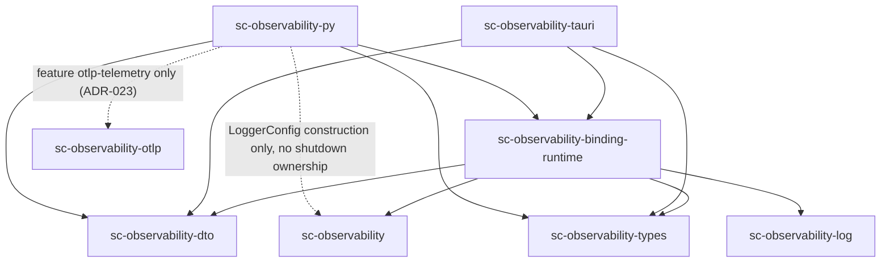

# SC-Observability Architecture

**Status**: Approved baseline; ADR-011–ADR-020 Accepted for Phase D
**Applies to**: `sc-observability-types`, `sc-observability`, `sc-observe`, `sc-observability-otlp`
**Related documents**:
- [`requirements.md`](./requirements.md)
- [`api-design.md`](./api-design.md)
- [`atm-quickstart.md`](./atm-quickstart.md)
- [`atm-adapter-requirements.md`](./atm-adapter-requirements.md)
- [`atm-adapter-architecture.md`](./atm-adapter-architecture.md)

## 1. System Overview

The workspace is a layered stack, not a monolith:

```text
sc-observability-types
  shared neutral contracts only
          |
sc-observability
  lightweight logging only
          |
sc-observe
  observation routing / pub-sub / projection
          |
sc-observability-otlp
  OpenTelemetry / OTLP integration
```

The critical architectural rule is that each layer can be understood in
isolation:

- the types layer does not know about logging, routing, or OTLP behavior
- the logging layer does not know about routing or OTLP behavior
- the routing layer depends on logging but not on OTLP
- the OTLP layer builds on the lower-level infrastructure and owns all OTel
  transport concerns

## 1.1 Approval Scope

```text
APPROVED for shared-repo boundary direction / blocker closure.
NOT YET sufficient as the complete ATM migration specification.
```

The shared workspace architecture is approved when the crate boundaries,
dependency layering, and generic extension points are correct. Complete ATM
migration confidence additionally requires the ATM adapter requirements and ATM
adapter architecture documents that define the compatibility behavior outside
this repo.

## 2. Architectural Principles

- Preserve linear layering.
- Keep `sc-observability` lightweight and self-contained.
- Keep `sc-observe` generic over downstream integrations.
- Keep OpenTelemetry concerns only in `sc-observability-otlp`.
- Keep shared contracts in `sc-observability-types` neutral and ATM-free.
- Prevent higher-layer requirements from leaking downward.

## 3. Per-Crate Architecture

### 3.1 `sc-observability-types`

This crate is the shared contract layer.

Owns:

- `ErrorCode`, `Diagnostic`, `Remediation`, `ErrorContext`
- `Timestamp`, `DurationMs`
- `TraceContext`, `TraceId`, `SpanId`
- `LogEvent`
- typed stable labels such as `CorrelationId`, `OutcomeLabel`, `SinkName`, and
  `MetricUnit`
- `ObservabilityHealthProvider`
- `LogQuery`, `LogOrder`, `LogFieldMatch`
- `LogSnapshot`, `QueryError`, `QueryHealthState`, `QueryHealthReport`
- `MaintenanceHealthReport`, `MaintenanceWorkerState`, `WriterState`
- health report contracts
- shared open traits such as `Observable`, subscribers, filters, and projectors
- the published sealed `DiagnosticInfo` diagnostic contract

Must not own:

- sinks
- concrete logging runtime behavior such as `Logger`, `LoggerBuilder`,
  `LogSink`, `SinkRegistration`, or built-in sink implementations
- routing runtime behavior
- OTLP exporters or OpenTelemetry dependencies
- application-specific observation payloads

Important boundary:

- this crate is neutral shared vocabulary, not a behavior layer

### 3.2 `sc-observability`

This crate is the lightweight logging layer.

Owns:

- `Logger`
- `LoggerConfig`
- retained-log maintenance policy and queue-backed writer runtime (see §3.2.1)
- `LoggerBuilder`
- `LogSink`
- `SinkRegistration`
- `JsonlFileSink`
- `ConsoleSink`
- redaction
- rotation
- `LoggingHealthReport`, `MaintenanceHealthReport`, `MaintenanceWorkerState`,
  `WriterState`, `SinkHealth`, and `SinkHealthState` defined in
  `sc-observability-types`, re-exported by `sc-observability`

Runtime role:

- validate and redact `LogEvent`
- fan out to local sinks
- record sink-local health and drop behavior
- expose crate-local logging injection traits implemented by `Logger`

Must not own:

- observation routing
- subscriber registries
- OTLP transport
- OpenTelemetry dependencies

This crate must remain usable on its own by a basic CLI.

### 3.2.1 Retained-Log Maintenance

Retained-log lifecycle management belongs to `sc-observability`, not to
downstream application wrappers.

Owns:

- `RetainedLogPolicy` struct nested in `LoggerConfig`
- `rotation_max_bytes`, `rotation_max_files`, and `retention_max_age`
- `maintenance_cadence`, `writer_shutdown_timeout`, and
  `maintenance_max_work_per_pass`
- writer-thread-owned maintenance lifecycle
- maintenance health reporting and bounded writer-thread shutdown-drain behavior

Approved architecture shape:

- the logging layer owns one queue-backed writer thread that admits validated
  log events from producer calls and owns batching, sink writes, rotation,
  pruning, flush, and shutdown drain
- maintenance runs on the writer thread during idle or post-batch windows
- producer calls validate, redact, and enqueue events; they do not perform
  built-in file-sink writes directly
- the writer thread is created, supervised, and joined entirely by
  `sc-observability`; downstream apps do not manage it directly
- a writer-thread maintenance pass may rotate the active file, prune excess
  retained files, prune stale retained files, and update maintenance health
  state
- bounded per-pass work exists so a single maintenance sweep cannot grow
  without limit

Health and shutdown contract:

- retained-log maintenance health belongs on the logging health surface
- health must capture the last maintenance pass timestamp, rotated/pruned
  totals, last maintenance error, and worker state
- `MaintenanceWorkerState` is owned by `sc-observability-types` with variants
  `Running`, `Degraded`, and `Stopped`
- `LoggingHealthReport` also carries queue depth, queue capacity,
  queue high-water mark, queue-full drop totals, writer state, and last writer
  error so downstream health/doctor commands can diagnose saturation
- maintenance failures are fail-open and do not stop logging
- `Logger::shutdown()` drains queued events and does not return until the
  writer thread has definitively joined
- if the shutdown timeout threshold is exceeded, shutdown records degraded
  state and then continues waiting for definitive writer completion

Layering rules:

- `sc-observability` owns the queue-backed writer runtime and the concrete
  retained-log policy surface
- `sc-observability-types` may own shared health-report types only if those
  types must cross crate boundaries
- `sc-observe` and `sc-observability-otlp` consume the resulting logging
  behavior but do not own retained-log maintenance
- ATM-specific wrappers may choose policy values, but they do not own the
  generic maintenance machinery

### 3.2.2 `sc-compose` Logging-Only Integration Contract

`sc-compose` is the reference logging-only downstream consumer for this crate.
Its architecture stays intentionally split:

- `sc-composer` keeps its own local observer/event layer
- `sc-compose` owns the adapter from that local layer into
  `sc-observability::Logger`
- `sc-composer` does not depend directly on `sc-observability-types`
- this contract is intentionally limited to simple logging-only integration;
  `sc-observe` and `sc-observability-otlp` are out of scope

The consumer-facing split is:

- `sc-observability-types` provides neutral contracts such as `LogEvent`,
  diagnostics, identifiers, `LoggingHealthReport`,
  `MaintenanceHealthReport`, `MaintenanceWorkerState`, `SinkHealth`,
  `SinkHealthState`, `QueryHealthReport`, and `QueryHealthState`
- `sc-observability` provides the concrete logging runtime surface:
  `Logger`, `LoggerConfig`, `LoggerBuilder`, `LogSink`, `SinkRegistration`,
  `ConsoleSink`, `JsonlFileSink`, `Logger::health()`, and
  `Logger::shutdown()`
- the adapter that translates `sc-composer` observer callbacks into `LogEvent`
  records belongs to `sc-compose`, not to this workspace

For this integration path, `LogEvent.service` is the configured CLI service
identity owned by `sc-compose`, while the remaining record fields are derived
from the local observer event being adapted.

Event sources for the adapter are:

- CLI-owned command lifecycle hooks in `sc-compose`
- the local `sc_composer::observer` callbacks emitted by composition work

Command lifecycle events are emitted directly by `sc-compose` around command
dispatch. They do not require additional callbacks from `sc-composer`.

For contract purposes, the local `sc-composer` observer surface must remain
object-safe and `dyn`-compatible, and must be sufficient for the CLI adapter to
translate composition events into `LogEvent` records. The minimum approved
shape is:

```rust
pub enum ObservationEvent {
    ResolveAttempt(ResolveAttemptEvent),
    ResolveOutcome(ResolveOutcomeEvent),
    IncludeExpandOutcome(IncludeOutcomeEvent),
    ValidationOutcome(ValidationOutcomeEvent),
    RenderOutcome(RenderOutcomeEvent),
}

pub trait ObservationSink {
    fn emit(&mut self, event: &ObservationEvent);
}

pub trait CompositionObserver {
    fn on_resolve_attempt(&mut self, event: &ResolveAttemptEvent) {}
    fn on_resolve_outcome(&mut self, event: &ResolveOutcomeEvent) {}
    fn on_include_outcome(&mut self, event: &IncludeOutcomeEvent) {}
    fn on_validation_outcome(&mut self, event: &ValidationOutcomeEvent) {}
    fn on_render_outcome(&mut self, event: &RenderOutcomeEvent) {}
}

pub fn compose_with_observer(
    request: &ComposeRequest,
    observer: &mut dyn CompositionObserver,
) -> Result<ComposeResult, ComposeError>;
```

The exact downstream type names may evolve, but the observer contract must keep
the same three properties:

- a local `ObservationEvent`-style composition event enum
- an object-safe sink/observer interface callable through `&mut dyn ...`
- `compose_with_observer(...)` as the end-to-end injection surface

Approved `sc-compose` wiring shape:

1. `sc-compose` constructs `LoggerConfig` and `Logger` during CLI startup.
2. Human-readable command execution may enable the built-in console sink in
   addition to the file sink.
3. Commands that emit machine-readable `--json` output disable the built-in
   console sink so stdout remains valid command output.
4. The `sc-compose observability-health` subcommand reads `Logger::health()`
   and returns the resulting `LoggingHealthReport`.
5. If the CLI does not install a logger-backed adapter, `sc-composer`
   continues to use its built-in no-op observer path and command behavior
   remains functional with logging disabled.
6. CLI shutdown calls `Logger::shutdown()` so registered sinks flush before
   exit.

The adapter-owned event mapping is:

| `sc-compose` event source | `LogEvent.target` | `LogEvent.action` | `LogEvent.message` | Other `LogEvent` fields |
| --- | --- | --- | --- | --- |
| command start | `compose.command` | `started` | human-readable summary such as `render started` | `fields` include command name and relevant mode flags |
| command end, success | `compose.command` | `completed` | human-readable summary such as `render completed` | `fields` include command name, elapsed time, and output mode; `outcome` is success |
| command end, failure | `compose.command` | `failed` | human-readable summary such as `render failed` | `fields` include command name, exit code, elapsed time, and output mode; `outcome` is failure; `diagnostic` is attached when available |
| resolve attempt or outcome | `compose.resolve` | phase-specific action such as `attempt`, `resolved`, or `failed` | concise resolver summary sentence | `outcome` reflects success/failure; `diagnostic` is attached for failures; resolver traces or selected paths live in `fields` |
| include-expand outcome | `compose.include_expand` | phase-specific action such as `expanded` or `failed` | concise include-expansion summary sentence | include stack and path details live in `fields`; failures attach `diagnostic` |
| validation outcome | `compose.validate` | phase-specific action such as `completed` or `failed` | concise validation summary sentence | validation counts and policy decisions live in `fields`; failures attach `diagnostic` |
| render outcome | `compose.render` | phase-specific action such as `completed` or `failed` | concise render summary sentence | render metadata lives in `fields`; `outcome` and `diagnostic` reflect success/failure |

This mapping is intentionally adapter-owned so `sc-observability` preserves a
generic logging contract and does not absorb `sc-compose`-specific event
taxonomies.

### 3.2.3 Consumer Usability Follow-Ups

The remaining consumer-facing logging-surface follow-ups stay in
`sc-observability` and do not move into `sc-observe` or
`sc-observability-otlp`.

- the default active JSONL path becomes
  `<log_root>/logs/<service>.log.jsonl`
  - approved simplification note: the older nested layout
    `<log_root>/<service>/logs/<service>.log.jsonl` was dropped so operators
    manage one stable `logs/` subtree per configured root instead of
    duplicating the service segment in both the directory tree and filename
- `ConsoleSink` keeps a small public writer-selection surface:
  `ConsoleSink::stdout()` and `ConsoleSink::stderr()` are public, while
  arbitrary writer injection remains non-public
- retained-sink fault injection lives in the retained-sink layer, not in the
  query/follow layer, and is exposed only through a deliberate validation-only
  surface such as `#[cfg(test)]` or a `fault-injection` feature
- consumer-facing onboarding artifacts (`README.md`, `CONSUMING.md`, and
  `examples/custom-sink-example/`) document and validate the public logging
  surface without relying on workspace-internal APIs
- `examples/custom-sink-example/` must compile against the public API only so
  it continuously proves that the shipped sink extension points are sufficient
  for downstream consumers
  - The D.17 consumer migration completes the temporary exception tracked in [the D.3 plan](plans/phase-d/sprint-d-3-typed-sink-registration.md). [`validate_repo_boundaries.sh`](../scripts/ci/validate_repo_boundaries.sh) now requires the custom-sink consumer to compile successfully, satisfying `obs-d-17#2`.

### 3.2.4 Query And Follow Extension

The query/follow feature remains part of the logging layer. It does not move
into `sc-observe`, does not depend on `sc-observability-otlp`, and does not
require an async runtime.

Type ownership is split as follows:

- `sc-observability-types` owns `LogQuery`, `LogOrder`,
  `LogFieldMatch`, `LogSnapshot`, `QueryError`,
  `QueryHealthState`, `QueryHealthReport`, `MaintenanceHealthReport`,
  `MaintenanceWorkerState`, `WriterState`, and
  `ObservabilityHealthProvider`
- `sc-observability-types` extends `LoggingHealthReport` with
  `flush_errors_total`, `queue_depth`, `queue_capacity`,
  `queue_high_water_mark`, `queue_full_drops_total`, `writer_state`,
  `last_writer_error`, `query: Option<QueryHealthReport>`, and
  `maintenance: Option<MaintenanceHealthReport>`
- `sc-observability` owns `Logger::query`, `Logger::follow`,
  `LogFollowSession`, and `JsonlLogReader`

Approved public API surface for this sprint:

```rust
pub enum LogOrder {
    OldestFirst,
    NewestFirst,
}

pub struct LogFieldMatch {
    pub field: String,
    pub value: serde_json::Value,
}

pub struct LogQuery {
    pub service: Option<ServiceName>,
    pub levels: Vec<Level>,
    pub target: Option<TargetCategory>,
    pub action: Option<ActionName>,
    pub request_id: Option<CorrelationId>,
    pub correlation_id: Option<CorrelationId>,
    pub since: Option<Timestamp>,
    pub until: Option<Timestamp>,
    pub field_matches: Vec<LogFieldMatch>,
    pub limit: Option<usize>,
    pub order: LogOrder,
}

pub struct LogSnapshot {
    pub events: Vec<LogEvent>,
    pub truncated: bool,
}

pub enum QueryError {
    InvalidQuery(Box<ErrorContext>),
    Io(Box<ErrorContext>),
    Decode(Box<ErrorContext>),
    Unavailable(Box<ErrorContext>),
    Shutdown,
}

pub enum QueryHealthState {
    Healthy,
    Degraded,
    Unavailable,
}

pub struct QueryHealthReport {
    pub state: QueryHealthState,
    pub last_error: Option<DiagnosticSummary>,
}

pub enum MaintenanceWorkerState {
    Running,
    Degraded,
    Stopped,
}

pub struct MaintenanceHealthReport {
    pub state: MaintenanceWorkerState,
    pub last_pass_at: Option<Timestamp>,
    pub rotated_files_total: FileCount,
    pub pruned_files_total: FileCount,
    pub last_error: Option<DiagnosticSummary>,
}

pub struct LoggingHealthReport {
    pub state: LoggingHealthState,
    pub dropped_events_total: u64,
    pub flush_errors_total: u64,
    pub active_log_path: std::path::PathBuf,
    pub sink_statuses: Vec<SinkHealth>,
    pub queue_depth: u64,
    pub queue_capacity: u64,
    pub queue_high_water_mark: u64,
    pub queue_full_drops_total: u64,
    pub writer_state: WriterState,
    pub last_writer_error: Option<DiagnosticSummary>,
    pub query: Option<QueryHealthReport>,
    pub maintenance: Option<MaintenanceHealthReport>,
    pub last_error: Option<DiagnosticSummary>,
}

pub enum WriterState {
    Running,
    Degraded,
    Stopped,
}

pub trait ObservabilityHealthProvider: telemetry_health_provider_sealed::Sealed + Send + Sync {
    fn telemetry_health(&self) -> TelemetryHealthReport;
}

impl Logger<Running> {
    pub fn query(&self, query: &LogQuery) -> Result<LogSnapshot, QueryError>;
    pub fn follow(&self, query: LogQuery) -> Result<LogFollowSession, QueryError>;
}

pub struct LogFollowSession {
    /* opaque */
}

impl LogFollowSession {
    pub fn poll(&mut self) -> Result<LogSnapshot, QueryError>;
    pub fn health(&self) -> QueryHealthReport;
}

pub struct JsonlLogReader {
    /* opaque */
}

impl JsonlLogReader {
    pub fn new(active_log_path: std::path::PathBuf) -> Self;
    pub fn query(&self, query: &LogQuery) -> Result<LogSnapshot, QueryError>;
    pub fn follow(&self, query: LogQuery) -> Result<LogFollowSession, QueryError>;
}
```

`flush_errors_total` remains part of `LoggingHealthReport` in the writer-thread
model so flush-failure accounting stays visible even after queue and writer
health fields are added.

`QueryError` is backed by the stable error-code constants
`SC_LOG_QUERY_INVALID_QUERY`, `SC_LOG_QUERY_IO`, `SC_LOG_QUERY_DECODE`,
`SC_LOG_QUERY_UNAVAILABLE`, and `SC_LOG_QUERY_SHUTDOWN` per `requirements.md`
TYP-036.

Behavioral boundaries:

- `Logger::query` and `Logger::follow` are convenience entry points over the
  logger's active JSONL path and documented rotation layout
- `JsonlLogReader` is reusable by tools that need offline inspection without a
  live logger instance
- `LogFollowSession` stays synchronous and caller-driven: no runtime-managed
  background work, async executor, or socket-style streaming surface
- logger-created `LogFollowSession` instances become unavailable once the
  owning `Logger` shuts down; `JsonlLogReader` sessions remain independent
- `QueryError` stays in `sc-observability-types` so all logging query surfaces
  share one stable error vocabulary

### 3.3 `sc-observe`

This crate is the observation runtime layered on top of logging.

Owns:

- `Observability`
- `ObservabilityBuilder`
- `ObservabilityConfig`
- subscriber registration
- projector registration
- observation routing and fan-out
- `ObservabilityHealthReport` and `ObservationHealthState` defined in
  `sc-observability-types`, re-exported by `sc-observe`

Runtime role:

- accept `Observation<T>`
- route to typed subscribers
- project to `LogEvent`
- send logs into the logging layer
- expose generic downstream extension points for higher-layer integrations
- expose crate-local observation injection traits implemented by
  `Observability`

Must not own:

- OpenTelemetry transport or OTel-specific configuration
- direct dependency on `sc-observability-otlp`
- application-specific payload taxonomies

The key point is that `sc-observe` is a routing/runtime layer, not an OTLP
layer.

### 3.4 `sc-observability-otlp`

This crate is the top-of-stack OpenTelemetry layer
([ADR-023](#adr-023-native-opentelemetry-and-thin-synchronous-frontends)).

Owns:

- `OtelLogSink` (feature `log-sink`): maps redacted core `LogEvent`s to native
  log records from a caller-owned `SdkLoggerProvider` through the existing
  `LogSink` extension point
- `sync::Client` (feature `synchronous-client`): exports logs, completed spans
  and metrics through the official blocking OTLP/HTTP protobuf exporter
- `api`/`sdk` re-exports of the official `opentelemetry` and
  `opentelemetry_sdk` types those contracts name
- `constants` (`DEFAULT_OTLP_TIMEOUT_MS`, `MAX_INPUT_BYTES`,
  `MAX_BATCH_RECORDS`) and `error_codes` (`TELEMETRY_EXPORT_FAILED`, `sync::*`)

Tokio hosts build the official SDK providers and OTLP exporters through the
`api`/`sdk`/`otlp` re-exports (feature `tokio-exporter`). The
`sc-otel` CLI and the Python `Telemetry` binding are thin frontends over
`sync::Client`.

Must not push OTLP concerns into the lower crates.

## 4. Runtime Composition

The layered design supports three normal application shapes.

### 4.1 Logging Only

```text
application -> sc-observability
```

Use when a CLI or tool needs structured logging only.

The query/follow API is part of this shape. An application may use `Logger`,
`Logger::query`, `Logger::follow`, or `JsonlLogReader` without enabling
`sc-observe` or `sc-observability-otlp`.

For `sc-compose`, this shape is:

```text
sc-composer local observer layer -> sc-compose adapter -> sc-observability::Logger
```

The important boundary is that `sc-compose` depends on `sc-observability` for
concrete logger behavior, while `sc-composer` remains independent from
`sc-observability-types` and keeps its local observer API.

### 4.2 Logging + Routing

```text
application -> sc-observe -> sc-observability
```

Use when one observation should fan out to logs and typed subscribers without
any OTLP dependency.

### 4.3 Full Stack

```text
application -> sc-observability-otlp (OtelLogSink, sync::Client)
                    |
                    v
              sc-observability
```

Use when the application needs OTel export in addition to logging. File-only,
OTel-only and both are selected with `LoggerConfig.enable_file_sink` plus
`register_sink` (H-004).

### 4.4 ATM-Shaped Baseline

The shared stack's ATM-shaped out-of-the-box behavior and minimal production
configuration are documented separately in [`atm-quickstart.md`](./atm-quickstart.md).

That document is part of the shared-repo detailed design because ATM is the
first sophisticated adopter, but it does not move ATM-owned compatibility
behavior into the shared crates.

### 4.5 Rotation-Aware Query/Follow

Historical query and follow behavior operate on one logical log stream made
from:

- the active path `<log_root>/logs/<service>.log.jsonl`
- rotated siblings using the existing `.N` suffix convention

Historical query strategy:

- resolve the active file and its rotated siblings once at query start
- treat that resolved set as a point-in-time snapshot for the duration of the
  query
- scan in oldest-to-newest order for `LogOrder::OldestFirst` and in reverse for
  `LogOrder::NewestFirst`
- apply filtering before limit truncation and report truncation through
  `LogSnapshot.truncated`
- surface malformed JSONL records or contract decode failures as
  `QueryError::Decode` rather than silently dropping them

Follow strategy:

- follow sessions begin at the tail of the currently visible log set and do not
  replay historical backlog; callers needing backlog plus tail must call
  `query()` first
- `LogFollowSession` tracks the active path, file identity, and current read
  offset
- `poll()` reads appended records since the last successful poll
- if the active file shrinks or its file identity changes, the session treats
  that as rotation/truncation, reopens the new active file, and resumes from
  offset `0`
- Unix-family platforms use `(dev, ino)` metadata, and Windows uses stable
  Win32 handle metadata via `GetFileInformationByHandle`
- non-Unix, non-Windows targets still rely on `(len, modified_nanos)` as the
  documented fallback identity
- the follow path remains poll-based and caller-driven; no async watch service
  is introduced

Validation:

- `limit = Some(0)` is invalid and returns `QueryError::InvalidQuery`
- `since > until` is invalid and returns `QueryError::InvalidQuery`
- `field_matches` use exact field-name lookup and exact JSON value equality

This strategy keeps the logging layer self-contained while still making
rotation behavior explicit enough for implementation and QA.

## 5. Producer Wiring

Producer code should be wired at the highest layer it needs:

- logging-only producers inject `Logger` or a narrow logging handle
- routing-aware producers inject `Observability`
- OTel-enabled producers register `OtelLogSink` with the logger or use the
  official SDK directly (H-002/H-004)

The important ownership rule is:

- producers emit one canonical observation
- lower layers do not require knowledge of higher-layer transports

### 5.1 Full-Stack Attachment Model

Superseded by H-004/ADR-023: `sc-observability-otlp` no longer registers span or
metric projectors with `sc-observe`; OTel logging attaches through the core
`LogSink` extension point.

## 6. Crate Boundary Table

| Crate | Depends On | Must Not Depend On | Public Surface Summary |
| --- | --- | --- | --- |
| `sc-observability-types` | shared support crates only | `sc-observability`, `sc-observe`, `sc-observability-otlp`, `agent-team-mail-*` | shared contracts, typed identifiers, UTC timestamps, typed durations, diagnostics, shared traits including `ObservabilityHealthProvider`, health type definitions including `LoggingHealthReport`, `MaintenanceHealthReport`, `MaintenanceWorkerState`, and `WriterState`, and logging query/follow value and error contracts |
| `sc-observability` | `sc-observability-types` | `sc-observe`, `sc-observability-otlp`, `agent-team-mail-*` | lightweight logging, sinks, legacy direct rotation helpers, `RetainedLogPolicy`, queue-backed writer runtime, `Logger`, `JsonlLogReader`, follow session runtime, and logging health/maintenance re-exports including `MaintenanceHealthReport`, `MaintenanceWorkerState`, and `WriterState` |
| `sc-observe` | `sc-observability-types`, `sc-observability` | `sc-observability-otlp`, `agent-team-mail-*` | observation routing, subscribers, log projectors, top-level health re-exports; no OTLP dependents |
| `sc-observability-otlp` | `sc-observability-types`; optional `opentelemetry`, `opentelemetry_sdk` (feature `native`); optional `sc-observability`, `serde_json` (feature `log-sink`, with `native`); optional `opentelemetry-otlp`, `opentelemetry-http`, `otel-reqwest` (reqwest 0.13 blocking), `futures-executor`, `tokio`, and on Unix `libc` for the non-blocking bounded file open (feature `synchronous-client`, with `native`); `opentelemetry-otlp` also under feature `tokio-exporter` (with `native`); dev-only `sc-observability`, `time`, `tempfile`, `tokio`, `rustls`, `rcgen`, `opentelemetry-proto`, `prost` ([ADR-023](#adr-023-native-opentelemetry-and-thin-synchronous-frontends)) | `sc-observe`, `agent-team-mail-*` | `OtelLogSink`, `sync::Client`, `api`/`sdk`/`otlp` official re-exports, OTLP constants and error codes |
| `sc-observability-log`† | `sc-observability`, `sc-observability-types`, `sc-observability-log-macros` (exact-pinned) | `sc-observe`, `sc-observability-otlp`, `agent-team-mail-*`, Tauri/Specta/PyO3 | `log`-facade bridge and tracing-compatible event/`#[instrument]` macros re-exports; `LogGuard`/`LogControl` lifecycle; `InitError`/`FlushError`/`ShutdownError`/`DetachError` are a scoped TYP-030 companion exception (PHB-002); B.1 mechanical copy, unpublished |
| `sc-observability-dto`† | `sc-observability-types`, `serde`, `serde_json`; optional exact-pinned Schemars tooling | core runtime, bridge, Tauri, PyO3, ownership capabilities | B.3 schema-v1 wire projections and checked conversions; scoped TYP-030 wire-only exception, no native type replacement |
| `sc-observability-schema` | `sc-observability-dto` (with the `schema-gen` feature) | runtime crates, binding runtimes, and host/framework crates | isolated, unpublished schema-generator crate under `bindings/schema-generator/`; emits schema artifacts from DTO wire types |
| `sc-observability-log-macros`† | third-party proc-macro support only (`syn`, `quote`, `proc-macro2`) | `sc-observability-log` (no reverse dependency back to the bridge), `sc-observability`, `sc-observe`, `sc-observability-otlp`, `agent-team-mail-*` | procedural macro expansion only for `sc-observability-log`'s event/`#[instrument]` forms; no runtime types; B.1 mechanical copy, unpublished |
| `sc-observability-log-consumer-check`† | `sc-observability-log` only (direct path dependency) | `sc-observability-log-macros` (macro expansion is exercised only through the bridge, preserving the external macro-expansion hygiene check), `agent-team-mail-*` | CI-only compile-time proof that macro consumers need only the bridge dependency; never published |
| `sc-otel-cli` | `sc-observability-otlp` (feature `synchronous-client`) | `sc-observe`, PyO3, `agent-team-mail-*` | `sc-otel` command-line telemetry frontend; workspace member, `publish = false` |
| `sc-observability-py` | `sc-observability`, `sc-observability-binding-runtime`, `sc-observability-dto`, `sc-observability-types`; optionally `sc-observability-otlp` (`otlp-telemetry` enables `synchronous-client`) | `agent-team-mail-*` | owned and host-attached Python bindings; optional native synchronous OTLP telemetry |

† This crate's ADR-011 companion-boundary placement (including its TYP-030 companion/wire-only exception scoping above) follows ADR-011's accepted companion-boundary decision.

### Phase B Binding Runtime Edges

The shared native runtime provides core and bridge backends, bounded operations
and the unique core shutdown owner. `arc-swap` publishes immutable health and
logger references without an admission mutex; `serde_json` supports checked DTO
conversion. These support crates add no host/framework dependency. The resolved
workspace allowlist and aliased/target host edges are checked by
`scripts/ci/validate_binding_runtime_dependencies.py`.


B.3b structural/dependency CI enforces this exact set of workspace
edges for sc-observability-binding-runtime; third-party support crates retain
normal dependency review. Tauri and PyO3 may depend on the runtime, never the
reverse. This proposed diagram does not claim the crate is implemented.

`scripts/ci/validate_binding_runtime_dependencies.py` resolves and checks the
shared runtime manifest plus both consumer manifests. It includes ordinary,
build, dev, target-specific and aliased workspace declarations, so a renamed
workspace dependency cannot evade the first-party or forbidden-host policy.

Both binding crates also declare direct `sc-observability-dto` and
`sc-observability-types` dependencies, alongside their `Runtime` edge, not
instead of it. This is permitted: DTO and Types are the neutral, leaf-level
wire/contract crates plan-phase-b.md's binding architecture describes as
depending on "public types, not Tauri or PyO3" — any consumer, including a
binding crate, may take them directly without duplicating the Runtime's
responsibilities. `sc-observability-py` additionally depends directly on
`sc-observability` (core) itself, used only to construct a
`sc_observability::LoggerConfig` value from Python-supplied inputs
(`bindings/python/sc-observability-py/src/lib.rs`); it does not call, hold, or
otherwise duplicate the core logger's own lifecycle/shutdown ownership, which
the Runtime alone retains. No Tauri/PyO3-facing crate gains an independent
shutdown-owning edge to core through either dependency; the Runtime-only rule
is about lifecycle/shutdown ownership, not about every possible workspace
compile-time edge.


```mermaid
graph TD
  Runtime[sc-observability-binding-runtime] --> Core[sc-observability]
  Runtime --> Types[sc-observability-types]
  Runtime --> DTO[sc-observability-dto]
  Runtime --> Bridge[sc-observability-log]
  Tauri[sc-observability-tauri] --> Runtime
  Tauri --> DTO
  Tauri --> Types
  Python[sc-observability-py] --> Runtime
  Python --> DTO
  Python --> Types
  Python -. "LoggerConfig construction only, no shutdown ownership" .-> Core
  Python -. "feature otlp-telemetry only (ADR-023)" .-> OTLP[sc-observability-otlp]
```

One feature-gated edge exists (ADR-023): with the `otlp-telemetry` Cargo
feature, `sc-observability-py` depends on `sc-observability-otlp` (feature
`synchronous-client`). Release wheels enable that feature through
`[tool.maturin] features`. The binding runtime, Tauri and DTO crates gain no
OTLP edge, and the Python crate without the feature has none.

### OTLP transport allowlist

`policy/otlp-transport.toml` binds the reviewed `opentelemetry`,
`opentelemetry_sdk`, `opentelemetry-otlp`, `opentelemetry-http`,
`futures-executor`, `otel-reqwest` (`reqwest =0.13.5`, `blocking`, `rustls`)
and Tokio pins to the `native`, `log-sink`, `synchronous-client` and
`tokio-exporter` features (ADR-023).
The `synchronous-client` exporter uses the official blocking reqwest client and
requires no caller-owned runtime. No wildcard approval covers an unrelated
dependency; the existing boundary manifest is the single machine allowlist.

The OTLP crate's dev-dependencies support its tests: `time` for timestamps,
`tempfile` for temporary-file tests, `sc-observability` and `tokio` for sink
and Tokio-path tests, and `opentelemetry-proto`, `prost`, `rustls` (`ring`)
and `rcgen` to decode requests and serve TLS at the synchronous client's
loopback test collector. The
production `sc-observability` edge exists only under the optional `log-sink`
feature, which `OtelLogSink` needs
([ADR-023](#adr-023-native-opentelemetry-and-thin-synchronous-frontends)).

## 6.1 Query/Follow Dependency Order

The implementation dependency order for the query/follow work is:

```text
#24 LogQuery
  -> #25 QueryError
    -> (#26 historical query, #27 follow/tail, #28 query health)
      -> #29 JsonlLogReader
```

Consequences:

- the contract and error vocabulary land before runtime behavior
- issues `#26`, `#27`, and `#28` may proceed in parallel once `#24` and `#25`
  are merged
- `#29` finalizes the standalone reader after the logger-facing API and health
  behavior are already fixed
- the public signatures above must remain stable across that sequence

## 7. ADRs

ADR navigation index (status is recorded in each decision below):

- [ADR-001: Observation-First Producers](#adr-001-observation-first-producers)
- [ADR-002: Linear Dependency Order](#adr-002-linear-dependency-order)
- [ADR-003: Logging Is Self-Contained](#adr-003-logging-is-self-contained)
- [ADR-004: OTel Belongs Only At The Top](#adr-004-otel-belongs-only-at-the-top)
- [ADR-005: Centralized Registries For Error Codes And Constants](#adr-005-centralized-registries-for-error-codes-and-constants)
- [ADR-006: ATM Adapter Boundary](#adr-006-atm-adapter-boundary)
- [ADR-007: Boot-Phase Observability Precedes Plugin Registration](#adr-007-boot-phase-observability-precedes-plugin-registration)
- [ADR-008: Shared Approval Is Not ATM Migration Approval](#adr-008-shared-approval-is-not-atm-migration-approval)
- [ADR-009: Boundary CI Must Enforce Shared-Repo Purity](#adr-009-boundary-ci-must-enforce-shared-repo-purity)
- [ADR-010: Queue-Backed Writer Thread Owns Logging And Maintenance](#adr-010-queue-backed-writer-thread-owns-logging-and-maintenance)
- [ADR-011: Companion Boundaries And Pre-Copy Contract](#adr-011-companion-boundaries-and-pre-copy-contract)
- [ADR-012: Additive Typed Errors And Warning-Only Migration](#adr-012-additive-typed-errors-and-warning-only-migration)
- [ADR-013: Owner-Controlled Shared Runtime Level](#adr-013-owner-controlled-shared-runtime-level)
- [ADR-014: Result-Preserving Language Boundaries](#adr-014-result-preserving-language-boundaries)
- [ADR-015: Embedded Python And Shared Binding Runtime](#adr-015-embedded-python-and-shared-binding-runtime)
- [ADR-016: Shared Publishing Pipeline Adoption](#adr-016-shared-publishing-pipeline-adoption)
- [ADR-017: Phase D 2.0 Error Surface](#adr-017-phase-d-20-error-surface)
- [ADR-018: Dual OTLP Backends And Shared Lifecycle](#adr-018-dual-otlp-backends-and-shared-lifecycle)
- [ADR-019: Phase D Implementation Decisions](#adr-019-phase-d-implementation-decisions)
- [ADR-020: Compatible 1.x Adoption Of Phase D](#adr-020-compatible-1x-adoption-of-phase-d)
- [ADR-021: Shared Customer Telemetry Submission and Durable Admission](#adr-021-shared-customer-telemetry-submission-and-durable-admission)
- [ADR-022: Uniform Public API Across Release Targets](#adr-022-uniform-public-api-across-release-targets)
- [ADR-023: Native OpenTelemetry And Thin Synchronous Frontends](#adr-023-native-opentelemetry-and-thin-synchronous-frontends)

### ADR-001: Observation-First Producers

- **Status**: Accepted
- **Context**: Producers should not emit separate log, span, metric, and domain-event payloads for one fact.
- **Decision**: Producers emit one canonical observation and the layered stack fans it out downstream.
- **Consequences**:
  - producer code stays simple
  - logs and OTLP remain projections of the same observation

**Phase F amendment:** Observation routing is `sc_observe::v2`; the 1.x
facade is deprecated behind the default `v1` feature.

### ADR-002: Linear Dependency Order

- **Status**: Accepted
- **Context**: The prior document set collapsed the stack by making `sc-observe` depend on both logging and OTLP layers.
- **Decision**: The dependency order is `types <- sc-observability <- sc-observability-log`, `sc-observability <- sc-observe`, and `types <- sc-observability-otlp`; `sc-observability` is an OTLP test dev-dependency only; `sc-observe` is not a dependency of `sc-observability-otlp` of any kind.
- **Amended by ADR-023**: `sc-observability <- sc-observability-otlp` is also a
  production edge under the optional `log-sink` feature, for `OtelLogSink`
  only. `sc-observe` is no dependency of `sc-observability-otlp` (not even a
  dev-dependency), and no reverse edge exists.
- **Consequences**:
  - OTLP remains optional
  - `sc-observe` can be used without OpenTelemetry
  - lower layers stay readable without upper-layer concerns

### ADR-003: Logging Is Self-Contained

- **Status**: Accepted
- **Context**: `sc-observability` had begun to accumulate requirements from routing and OTLP.
- **Decision**: Keep `sc-observability` limited to logging concerns only.
- **Consequences**:
  - a basic CLI can adopt structured logging without extra runtime cost
  - logging requirements and architecture can be reviewed in isolation

### ADR-004: OTel Belongs Only At The Top

- **Status**: Accepted
- **Context**: OpenTelemetry transport concerns are implementation-heavy and should not pollute lower-layer APIs.
- **Decision**: All actual OpenTelemetry/OTLP dependencies and services belong in `sc-observability-otlp`.
- **Consequences**:
  - lower layers remain generic
  - OTel integration is opt-in
  - transport concerns are isolated where they belong

### ADR-005: Centralized Registries For Error Codes And Constants

- **Status**: Accepted
- **Context**: Scattered error-code definitions and inline policy numbers make review, documentation, and consistency checks harder across a multi-crate workspace.
- **Decision**: Each crate owns one dedicated error-code registry module and one dedicated constants module. Stable error codes are defined in the registry module, shared non-trivial constants are defined in the constants module, and non-trivial magic numbers are prohibited outside those definitions.
- **Consequences**:
  - reviewers have one obvious place to audit error codes per crate
  - documentation and reporting can enumerate public error codes consistently
  - policy limits, thresholds, retry counts, and similar values are named rather than hidden in inline literals
  - error-code registries remain separate from general-purpose constants so semantic stability is easier to enforce

### ADR-006: ATM Adapter Boundary

- **Status**: Accepted
- **Context**: ATM is the first and most sophisticated downstream adopter, but this repo must remain free of ATM production contracts and `agent-team-mail-*` dependencies.
- **Decision**: ATM-specific observability behavior belongs in an ATM-owned adapter boundary named `atm-observability-adapter`. Shared crates in this repo own only generic logging, routing, and OTLP infrastructure. ATM-specific contracts such as `LogEventV1`, daemon fan-in/spool compatibility, ATM-named env parsing, ATM health snapshots, and ATM-specific projector behavior move to the adapter boundary outside this repo.
- **Consequences**:
  - the shared repo remains generic and publishable without ATM coupling
  - **Retired in Phase F**: the former in-repository ATM proving crate and
    example proof are not shared-repo contract artifacts
  - production ATM compatibility logic is implemented in ATM-owned code, not in the shared repo

### ADR-007: Boot-Phase Observability Precedes Plugin Registration

- **Status**: Accepted
- **Context**: Early daemon and process lifecycle events occur before optional plugin or adapter context exists. Observability must be available during that boot phase.
- **Decision**: Core observability initialization happens before plugin registration or adapter-specific augmentation. Early lifecycle events must be recordable through the base logging/routing stack without requiring ATM plugin context.
- **Consequences**:
  - early startup failures remain observable
- adapters enrich the runtime after core observability is already available
- boot sequencing is explicit rather than left to implementation drift

### ADR-008: Shared Approval Is Not ATM Migration Approval

- **Status**: Accepted
- **Context**: The shared workspace can be architecturally sound while still
  leaving ATM-specific migration behavior under-specified.
- **Decision**: Treat the shared-repo document set as approval for generic crate
  boundaries and extension points only. Treat ATM migration completeness as a
  separate approval track owned by the ATM adapter documents.
- **Consequences**:
  - shared boundary cleanup can proceed without over-claiming ATM migration
    readiness
  - ATM-specific compatibility semantics remain owned by ATM adapter documents
  - review language stays precise about what has and has not been approved

### ADR-009: Boundary CI Must Enforce Shared-Repo Purity

- **Status**: Accepted
- **Context**: The shared-repo boundary can drift silently if CI only checks
  crate names and a few high-level doc strings.
- **Decision**: Boundary CI must enforce no ATM-specific imports or env reads in
  shared crates, no home/path discovery in shared crates outside generic config
  helpers, and no OTLP/OpenTelemetry dependency outside
  `sc-observability-otlp`.
- **Consequences**:
  - layer violations are caught before merge
- ATM-specific behavior remains in the ATM-owned adapter boundary
- **Retired in Phase F**: the former ATM proving artifact is not executable
  shared-repo evidence; ATM-owned integration evidence remains outside this
  repository

### ADR-010: Queue-Backed Writer Thread Owns Logging And Maintenance

- **Status**: Accepted
- **Context**: The prior retained-log model used producer-thread sink writes
  plus a dedicated maintenance-only background worker. That split kept
  low-priority maintenance off the emit path, but it left the main file I/O,
  sink mutation, and rotation coordination on producer threads while still
  paying the complexity cost of a separate thread.
- **Decision**: Replace the dedicated maintenance-only worker model with a
  single queue-backed writer thread. Producer calls validate, redact, and
  enqueue records. The writer thread owns batching, sink writes, retained-log
  rotation, retained-log pruning, flush, and shutdown drain behavior.
  Maintenance runs on the same writer thread during idle or post-batch
  windows.
- **Rationale**:
  - removes built-in file-sink locks and rotation coordination from the
    producer hot path
  - gives one execution owner for file writes, maintenance, and shutdown
    sequencing
  - makes queue depth, queue saturation, and writer degradation measurable
    through one health surface
  - keeps the crate free of async-runtime dependencies while still moving file
    I/O off producer threads
- **Rejected Alternative**: rejected alternative of retaining a dedicated maintenance-only worker alongside the new writer thread. That option would keep two background execution lanes for one sink system, increase shutdown coordination complexity, and preserve split ownership over rotation/pruning versus writes.
- **Consequences**:
- `log()` succeeds on queue admission, not durability; `flush()` remains the
  barrier for committed writes
- `try_log()` may return explicit queue-full failure under saturation rather
  than silently dropping records
- queue-full drops, writer degradation, and last-writer-error reporting are
  part of `LoggingHealthReport`
  - `Logger::shutdown()` drains queued events and waits for definitive writer
    completion; exceeding the configured timeout records degraded health but
    does not return a stopped logger while the writer remains detached
  - `MaintenanceWorkerState` remains the retained-log maintenance health
    vocabulary, but its semantics describe writer-owned maintenance execution
    rather than an independently joinable background thread

### ADR-011: Companion Boundaries And Pre-Copy Contract

- **Status**: Accepted 2026-09-26 by the technical lead (retroactive; implemented in Phase B; this PR is the acceptance record). It does not amend earlier accepted ADRs.
- **Context**: The log bridge is being extracted from BTIT for public reuse,
  while TypeScript and Python need shared logging without lower-layer runtime
  dependencies. TYP-030 currently centralizes core errors and health.
- **Proposed decision**: Keep the existing four-crate layering unchanged. Add
  bridge/macros above core; the bridge owns only its facade/lifecycle errors,
  health and constants. Add a neutral DTO crate for versioned wire projections,
  with Tauri and PyO3 conversion/transport implementations above those contracts.
  Neither DTOs nor neutral types depend on bridge runtime, Tauri, PyO3 or OTLP.
  This is a scoped TYP-030 companion exception; existing core definitions keep
  their owner. sc-observability accepts its target contract first, BTIT implements
  and reviews every foreseeable bridge change before the mechanical B.1 copy.
- **Consequences**: One host-owned writer/control boundary serves backend,
  frontend and attached Python. Bridge ownership is unique, producer controls
  cannot initiate shutdown. Shutdown waiters can retrieve the retained terminal
  result through wait_stopped. A timed-out flush has no prior-result accessor;
  its native operation continues and later health/slot availability reflect
  completion without treating a new flush as observation of the old one. Core shutdown still waits for definitive completion (ADR-010); bridge
  timeout bounds the caller's wait, not writer completion. No post-copy bridge
  redesign or BTIT dependency switch is scheduled here. The bridge retains its
  accepted coordinator; a separate shared binding-runtime coordinator handles
  core-only hosts, reused by Tauri/Python rather than duplicated per language.
  EmitOutcome is an alias of core AdmissionOutcome, not a duplicate enum.
- **Contracts**: PHB-001/002/014; [target API](plans/phase-b/target-bridge-api.md).

**Amendment (2026-09-26, CI retirement)**: The pre-copy contract is historical
acceptance evidence, not a permanent byte-identity restriction. The exact-blob
rule prevented the sc-obs team from redesigning a crate already working and
in use by BTIT. BTIT is moving to the new libraries, and the sc-obs team now
owns the shared API, so that check is outdated. The crates are
published and maintained here; reviewed Phase D changes intentionally evolve
them. Retire the BTIT import/snapshot comparison jobs and adaptation records.
Cargo compilation, behavioral tests, package verification and the existing
generated-binding regeneration and drift checks remain the gates.
No committed source-hash inventory, Git revision or historical blob pin is required
for generated bindings.

### ADR-012: Additive Typed Errors And Warning-Only Migration

**Phase F amendment:** PHF-002 governs deprecation before removal. The next
release remains 1.5.0 for every published crate; there is no major version
bump.

- **Status**: Accepted 2026-09-26 by the technical lead (retroactive; implemented in Phase B; this PR is the acceptance record). ADR-020 and PHF-002 govern the current release.
- **Context**: Issue #92 requests typed failure handling without a forced
  migration of consumers of published diagnostic wrappers and extension traits.
- **Proposed decision**: Add improved failure types, classification and operation/
  extension entry points. Preserve the published DiagnosticInfo seal and existing
  trait implementations/signatures and existing method-call resolution. New
  typed extension traits must not make old unqualified calls ambiguous. Legacy
  adapters retain metadata and wire
  shape, and deprecation notes name the replacement. Never replace
  published structs in place, add required legacy trait methods or mark existing
  enums non-exhaustive. Total unclassified handling preserves custom diagnostics.
- **Consequences**: One runtime implementation serves both APIs. Existing
  consumers continue with warnings under default lints; strict warning policies
  require deliberate migration. A practical adoption guide and old/new/custom
  trait fixtures are release gates. Removal follows PHF-002. The newly published B.P1 owner constructors remain exempt from
  B.1e method deprecation, avoiding publish-then-deprecate churn. InitError
  wrapper warnings remain distinct; explicit legacy type users may need narrow
  lint allowances, while typed alternatives are available. The stock public-API
  check records the accepted release surface.
- **Contracts**: PHB-003–006; [error migration](plans/phase-b/sprint-b-1a-error-api.md).

### ADR-013: Owner-Controlled Shared Runtime Level

- **Status**: Accepted 2026-09-26 by the technical lead (retroactive; implemented in Phase B; this PR is the acceptance record).
- **Context**: Issue #97 requires runtime verbosity changes across core, facade
  and bindings; a bridge-only threshold cannot override core config filtering.
- **Proposed decision**: Core owns effective state and serializes its transitions
  with admission/shutdown. Add a separate mutation capability, read-only state
  accessors and typed elevate/reset outcomes without changing published health
  or config construction. Baseline is immutable; overrides are nonpersistent,
  above-or-equal to baseline, and explicitly reset by the owner. Attached clients
  request authorized changes from the application rather than gaining ownership.
- **Consequences**: The accepted 1.4.x release supplied the staged core support
  used by BTIT integration and copy; B.7 owned later live publication. One
  coherent revision identifies each actual transition. Queued events
  are not retroactively filtered. Failed diagnostic admission is distinct from a
  successful change and preserves queue/redaction/sink policy. Supported release
  feature graphs retain required sites; runtime changes cannot undo compile-time
  filtering. #96 is not a dependency; no timer/lease stack is introduced.
- **Contracts**: PHB-007–009; [runtime contract](plans/phase-b/runtime-level-contract.md).

**Amendment (2026-09-26, release preflight)**: ADR-013’s original B.P2
qualification obligation was satisfied by the 1.4.x release, now in use by BTIT;
B.2/B.P2 qualification remains available as publisher-run, on-demand release
preflight before publishing, not as a sprint or integration PR gate, as recorded
in [the CI policy](ci-policy.md).

### ADR-014: Result-Preserving Language Boundaries

- **Status**: Accepted 2026-09-26 by the technical lead (retroactive; implemented in Phase B; this PR is the acceptance record).
- **Context**: Mixed Rust/Python and Tauri frontend applications need first-class
  logging that cannot make application work fail when a log cannot be recorded.
- **Proposed decision**: Use discriminated operational results through public
  Rust/TypeScript/Python boundaries, versioned neutral wire values and explicit
  checked conversions. Tauri handlers resolve tagged envelopes; Python factories
  and waits return tagged data. Expected failures do not intentionally throw,
  raise or panic. Convert foreign failures at the boundary. Default submissions
  are nonblocking; optional waits never turn admission into persistence claims.
- **Consequences**: Ignored errors are caller omissions, not hidden success.
  Required unit-return protocol adapters retain results in bounded status.
  Python supports owned and attached modes with explicit context transfer and
  bounded optional flush waits; receipt admission is synchronously resolved
  before submit returns. Observer timeout/cancellation ends observation, not the
  native operation. Bridge-native timeout can complete an adapter call while the
  bridge flush continues; the shared runtime contract distinguishes those slots. Existing infallible Rust accessors and source contracts stay intact.
  Node.js, Go, sc-runtime IPC/interpreters and durable receipts are deferred.
  Shared native backends own runtime conversions and bounded core-host operations;
  language wrappers own transport/extraction only. Canonical schema-v1 JSON drives
  both generated language models, with Rust Serde/schema agreement checked in CI.
- **Contracts**: PHB-010–014; [Phase B](plans/phase-b/plan-phase-b.md).

### ADR-015: Embedded Python And Shared Binding Runtime

- **Status**: Accepted 2026-09-26 by the technical lead (retroactive; implemented in Phase B; this PR is the acceptance record).
- **Context**: Attached Python must share a Rust host logger and its typed
  operations without exchanging Rust trait objects between independently linked
  libraries or building a new process transport before sc-runtime is specified.
- **Proposed decision**: Hosts link the `sc-observability-py` rlib and register
  its module in an embedded GIL-enabled interpreter. `install_host_logger` stores
  one immutable backend per module; repeated/racing installations return typed
  failures. Hosts install provided core/bridge backends from
  `sc-observability-binding-runtime`, which owns native DTO conversion and the
  bounded core-host operation coordinator. Python-owned mode uses the same core
  backend with a unique owner; attached mode never owns shutdown/level mutation.
  A standalone extension wheel is a separate loading mode, not a mechanism to
  exchange Rust objects with an independently compiled host extension.
- **Alternatives rejected for this phase**: C ABI/capsule/integer-pointer handles
  require a separate lifetime and ABI contract; separate wheel plus host shared
  library cannot safely assume Rust ABI/type identity; IPC introduces transport,
  ordering and supervisor semantics absent from the current runtime specification.
- **Consequences**: No replacement/reset installation, raw pointer or cross-dylib
  trait-object transfer. Python teardown releases loop-local flush observers,
  timers and module references; native completion never calls Python or acquires
  its GIL. Teardown
  cannot shut down the attached host. External-process attachment is deferred
  with the future Go/sc-runtime transport decision. This does not promise
  subinterpreter or free-threaded support. Shared backend policy and provenance
  apply equally to core-only and bridge hosts.
- **Contracts**: PHB-002/010–014;
  [native coordinator](plans/phase-b/native-binding-runtime.md),
  [Python embedding](plans/phase-b/sprint-b-4-python.md).

### ADR-016: Shared Publishing Pipeline Adoption

- **Status**: Accepted 2026-09-26 by the technical lead (retroactive; implemented in Phase C; this PR is the acceptance record).
- **Context**: This repository's release implementation
  (`.github/workflows/release.yml`/`release-preflight.yml`, the `publisher`
  agent, `.github/scripts/release_gate.sh`/`.github/scripts/release_artifacts.py`, and
  `release/publish-artifacts.toml`) is repository-specific and predates
  Phase B's expanded release surface (npm client, Python wheels/sdist,
  native/Tauri artifacts). `../sc-publish` is a separately-owned shared
  package intended to be the single publishing source of truth across
  repositories, installed verbatim via a caller-owned JSON contract rather
  than copied and hand-modified.
- **Proposed decision**: Adopt `../sc-publish` as the publishing
  implementation, installed via `plugins/sc-publish/install.py --input
  install.json` at a pinned, reviewed shared-package revision. The
  installer's copied `.claude`/`.github`/`release` assets replace this
  repo's bespoke release workflows, `publisher` agent and manifest scripts;
  only the two release manifests (`release/publish-artifacts.toml`,
  `release/publish-channel-contracts.toml`) are repository-rendered from the
  install contract. The shared package's channel set does not include npm at
  the pinned revision inspected while writing this ADR. This repo does not
  build a repository-owned npm publish step as a substitute: an npm channel
  in `../sc-publish`, owned upstream and consumed at a reviewed pin (matching
  the existing `pypi` channel's shape — its own agent, environment-scoped
  secret, and preflight/retry contract), is a named execution prerequisite
  for the sprint that installs the shared package. Likewise, a `../sc-publish`
  revision with action-runtime pins at or above this repository's current
  floor (`actions/checkout>=v5`, `actions/setup-python>=v6`) is a named
  execution prerequisite, verified when adopting the reviewed upstream
  revision, not an accepted regression. The permanent repository action-version
  floor gate is retired; the adoption prerequisite remains. If either upstream capability
  cannot land before Phase C needs to execute, Phase C stops and requests an
  explicit owner decision (delay execution, or accept a documented,
  owner-signed-off temporary gap) rather than treating a local substitute as
  equivalent shared-package adoption.
- **Alternatives rejected for this phase**: Continuing to maintain a
  repository-specific release pipeline duplicates logic already centralized
  in the shared package and diverges further as more repositories adopt it.
  Hand-patching the installer's vendored workflow files (for example to
  change pinned action versions) defeats the shared-source-of-truth model.
  Building a repository-local npm publish workflow, or installing the
  currently-pinned stale action versions and tracking the mismatch only as a
  follow-up ticket, would both reintroduce the bespoke, repository-specific
  publishing implementation this ADR replaces — rejected as contrary to the
  owner's stated intent for this phase.
- **Consequences**: This repo's publish operating model moves from a
  `team-lead`-directed `publisher` agent following a repo-local runbook to
  the shared package's named ATM `publisher` teammate plus role-specific
  background channel workers, per `.claude/skills/publishing/SKILL.md`.
  Release-manifest schema changes (`required`, `publish`, `preflight_check`,
  `verify_install` per crate) apply to every existing published crate, not
  only Phase B additions, and cover the full ten-crate Phase B inventory
  including the standalone `sc-observability-tauri` workspace and the
  `sc-observability-py` Rust crate as a crates.io target distinct from its
  wheel/sdist artifact. Adopting the npm channel and the current action-
  runtime baseline as upstream prerequisites means Phase C's sprint sequence
  may pause pending that upstream work landing, or pending an explicit owner
  decision, rather than always completing on the originally inspected pin.
  Actual publication, tagging and BTIT integration tests remain out of scope
  for Phase C.
- **Contracts**: PHC-001–006; [Phase C](plans/phase-c/plan-phase-c.md).

### ADR-017: Phase D 2.0 Error Surface

**Phase F amendment:** PHF-002 governs deprecation before removal; the next release remains 1.5.0.

- **Status**: Accepted 2026-09-26 by the technical lead (this PR is the acceptance record); D.4 may proceed.
- **Context**: ADR-012 protected additive 1.x compatibility, while Phase D
  explicitly targets a major release that can replace opaque wrappers and the
  temporary parallel typed surface.
- **Current acceptance gate**: The stock public-API check records 1.5.0
  baselines and PHF-002 controls removal.
- **Contracts**: Phase D D.4; PHF-002.

### ADR-018: Dual OTLP Backends And Shared Lifecycle

**Phase F amendment:** PHF-002 governs deprecation before removal.

**Phase H amendment:** superseded by [ADR-023](#adr-023-native-opentelemetry-and-thin-synchronous-frontends) (H-006); the custom backends, lifecycle and `sync-http`/`otlp-sdk` features are removed.

- **Status**: Accepted 2026-09-26 by the technical lead (this PR is the acceptance record); D.6 may proceed.
- **Context**: Tokio-hosted consumers need the official SDK while synchronous
  and Python-hosted consumers need the previously tested blocking HTTP/JSON
  path without owning a Tokio runtime.
- **Decision**: Use one backend-neutral lifecycle state machine,
  ordered barriers, deadlines, health/accounting, and crate-private exporter
  traits. The official SDK adapter requires a caller Tokio runtime; the synchronous HTTP
  adapter owns a bounded plain-thread worker and uses the same lifecycle core.
  Backend/protocol combinations are validated at construction. Enabled
  transports never fall back to no-op. Imported code/docs are governed by
  OTLP-023/024.
  The dependency allowlist admits only the explicitly feature-gated
  `opentelemetry*` SDK family and reviewed transport dependencies; no unrelated
  dependency may be added under the OTLP feature.
- **Acceptance gate**: The technical lead accepts the backend/protocol/runtime
  matrix, canonical async lifecycle, queue/deadline behavior, and source provenance
  before D.6 lands production code.
- **Contracts**: OTLP-001–024; Phase D D.5–D.8.

### ADR-019: Phase D Implementation Decisions

**Phase F amendment:** PHF-002 governs deprecation before removal.

**Phase H amendment:** superseded by [ADR-023](#adr-023-native-opentelemetry-and-thin-synchronous-frontends) (H-006); the transport allowlist, `ExportError`/`ConfigFailure`/`TelemetryError`, the `error_codes::otlp` registry and the telemetry shutdown boundary are removed. Logging decisions remain binding.

- **Status**: Accepted 2026-09-26 by the technical lead (PR #227 is the acceptance record).
- **Context**: ADR-017/018 established the original 2.0 surface proposal and dual
  transports; ADR-020 now governs compatible 1.x adoption. The
  plan must also record the reviewed dependency-pin amendment, registry owner,
  logging structural choices and consumer migration recipe without inventing
  a second contract owner or serializing the two wave-1 contract sprints.
- **Decision — ADR-018 amendment**: Section 6's Phase D transport allowlist
  refines ADR-018 with the `sync-http` feature's reqwest/httpdate pins, explicit
  getrandom and Tokio rt/sync use, and independently gated SDK dependencies.
  obs-d-21 records the reviewed exact Cargo.lock/manifest pins. obs-d-8 uses
  this declaration without adding a second allowlist or editing ADR-018's
  accepted historical text.
- **Decision — ADR-005 registry ownership**: All `OTLP_*` constants used by
  types-owned `ExportError`, `ConfigFailure` and `TelemetryError` live in
  `crates/sc-observability-types/src/error_codes.rs`, including a named
  `otlp` submodule within that single registry. OTLP's own `error_codes.rs`
  re-exports these constants; it does not redefine their string values.
  Companion-only detach codes live in the bridge's sole error_codes.rs;
  core-only registration/settings codes live in core's sole error_codes.rs.
  obs-d-12 owns the shared names and registry rows. Constants remain separate.
- **Decision — retained telemetry shutdown boundary (retired in Phase F)**: The root
  `sc_observability_types::TelemetryError::Shutdown` remains the retained 1.x
  unit variant until the final facade migration, so existing unit-pattern
  consumers keep their source-compatible boundary. The canonical,
  data-carrying and `DiagnosticInfo`-implementing shutdown form is
  `sc_observability_types::v2::TelemetryError::Shutdown { context }`; it is
  adopted with the v2 `ExportFailure` migration. This is a compatibility
  boundary, not a second telemetry failure contract.
- **Decision — logging contracts**: obs-d-13 owns the settings shape, atomic
  retained-policy resolution and explicit JSON-root precedence; an empty
  explicit root is invalid. The host bridge uses an open object-safe policy
  trait and a non-owning attachment; detach takes `&mut self`, retains a
  timed-out handle for retry, and cannot shut down or change the host's level.
  Stale cloned controls return NotInstalled through the runtime slot check.
  Open typed sink contracts preserve source/remediation; no duplicate failure
  classifier is introduced. Final canonical signatures are specified in
  obs-d-13, but its wave-1 compiled fixtures use an error-parameterized private
  harness and existing baseline types, without importing obs-d-12's new
  errors or registry rows. Wave-2 runtime/bridge/builder consumers bind both
  contract artifacts. Under ADR-020, D22 freezes canonical namespace seams,
  D23–D26 preserve released roots through adapters, and D18 integrates both.
- **Decision — consumer migration**: obs-d-17 migrates the consumer-check and
  custom-sink/Tauri examples to canonical cause variants at each construction
  and match site, preserving diagnostic/source data and owner-only lifecycle
  capabilities. It compiles downstream open-trait implementations with
  deprecated usage denied. It does not reimplement runtime mappings or remove
  1.x wrappers. Under ADR-020, obs-d-18 owns combined compatibility/semver
  evidence and does not remove released wrappers; D27 owns release-validation
  tooling.
- **Decision — facade event-error boundary**: `Logger::emit` returns the
  retained `EventError`, whose signature cannot carry the separate
  `v2::ShutdownError::{Timeout, Drain}` variants. At this boundary only, a
  disconnected writer's admission failure (`LogError::WriterDegraded`) is
  projected to `EventError::Routing` with its diagnostic context preserved.
  The compatibility match also retains a `LogError::ShutdownTimedOut` arm,
  but the current public logger cannot reach it through `Logger::emit`: only
  `WriterRuntime::shutdown(self)` records the timeout, and its caller
  `Logger::shutdown(self)` consumes the running logger and returns
  `Logger<Stopped>`, which has no event-admission method. Actual shutdown
  timeouts are retained in the stopped logger's health, not returned as
  `ShutdownError` by this API. A sink drain failure is likewise not itself
  an emitter admission failure. The real-path regressions cover writer
  disconnection through `Logger::emit` and timeout diagnostics through stopped
  health; they do not manufacture a running logger after shutdown.
- **Decision — staged core exports**: the core crate temporarily re-exports
  only the v2 `EventError` and `LogSinkError` types consumed by its owned
  implementation. The remaining v2 error contracts stay owned by
  `sc-observability-types` until the compatible 1.x sprints publish the opt-in canonical exports under ADR-020; released roots remain compatible.
- **Consequences**: Contract ownership is independent in wave 1. Shared
  artifacts have producer/consumer handoffs, and backend implementations use
  the common lifecycle. No new boundary-rule framework is authorized. Cargo
  dependency graphs and Rust privacy enforce structural restrictions; existing
  validators check generated-binding regeneration and drift, package integrity
  and dependency boundaries.
- **Contracts**: PHD-001–004, PHB-002/010/013, LOG-004/009/042/046,
  OTLP-011/021/023, SRC-001–004; obs-d-12/13/17/8.

**Amendment (2026-09-26, CI retirement)**: The CI trim in
[PR #239](https://github.com/randlee/sc-observability/pull/239) retired the
historical import-provenance and generated-binding source-revision validators
as recorded in [the CI policy](ci-policy.md). ADR-019’s Consequences sentence
was reworded accordingly to describe the remaining validation.

#### ADR-019 amendment: staged neutral signal contracts

**Phase H amendment:** superseded by [ADR-023](#adr-023-native-opentelemetry-and-thin-synchronous-frontends) (H-006); the `v2` signal models are removed.

- **Status**: Accepted 2026-09-26 by the lead (ruling
  `01M3F5BQFV804H5G4W6HFNZ03V`); native attribute serde amended to the
  tagged form 2026-09-27 by the maintainer. The original ADR-019 acceptance
  above is unchanged.
- **Context**: ADR-017's error-wrapper replacement does not itself specify
  the neutral signal model or its temporary public module. D.12 needs to
  release these contracts while existing 1.x consumers continue to compile.
- **Decision — staging and ownership**: Expose the canonical errors and
  neutral signals under `sc_observability_types::v2` at the current workspace
  package version. Existing root exports retain their 1.x behavior during
  migration. ADR-020 supersedes the original D.21 2.0 activation and D.18 root
  replacement/removal sequence. PHF-002 determines removal through the `v1`
  feature and deprecation attributes. Neutral types remain owned
  by `sc-observability-types`, without runtime, transport or upper-layer
  dependencies (LAY-001, PHB-002, TYP-001/002).
- **Decision — neutral values**: `Attributes` is an ordered
  `BTreeMap<String, AttributeValue>`. `AttributeValue` represents booleans,
  signed/unsigned integers, finite floats, strings, arrays, objects and null.
  `FiniteF64` rejects NaN and infinities through construction and serde input.
  These public values do not expose `serde_json::Value` or transport types.
- **Decision — spans**: `TraceContext` carries validated trace/span IDs,
  an optional parent and `TraceFlags`; the flags preserve all eight bits.
  `SpanKind` distinguishes internal/server/client/producer/consumer work.
  `SpanLink` carries its own IDs, flags and attributes. Private
  `SpanRecord<SpanStarted>` fields and consuming `end` preserve the existing
  typestate contract; only `SpanRecord<SpanEnded>` exposes final duration.
  `SpanEvent` and `SpanSignal` represent lifecycle events without adding
  application metadata to trace correlation.
- **Decision — metrics**: `MetricRecord` contains discriminated `MetricValue`
  (`Gauge`, `Sum`, `Histogram`) instead of a separate `MetricKind` plus `f64`.
  `AggregationTemporality` and start timestamps carry delta/cumulative
  semantics. Checked construction and serde input enforce finite values,
  histogram bounds/bucket/count consistency, start at or before end,
  nonempty delta intervals and nonnegative monotonic sums. `HistogramPoint`
  preserves explicit bounds, integer bucket counts/count and finite sum.
- **Decision — serde and wire projection**: Native `AttributeValue` serde is
  adjacently tagged, for example `{"kind":"int","data":5}`; `kind` is one of
  `bool`, `int`, `uint`, `float`, `string`, `array`, `object` or `null`, and
  `null` has no `data`. Tags preserve the exact variant, including `Int` and
  `UInt` of the same non-negative value, recursively through arrays and
  objects. `FiniteF64` is a number and `TraceFlags` a byte. `SpanKind` and `AggregationTemporality` use snake-case tokens.
  `MetricValue` uses adjacent `kind`/`data` tags, for example
  `{"kind":"gauge","data":1.5}`. Records serialize named fields;
  `SpanRecord` omits its typestate marker and `SpanSignal` uses external
  `Started`/`Event`/`Ended` tags. Span records are serialize-only: wire input
  must replay checked construction and `end`, not deserialize private state.
  Native serde is distinct from the versioned DTO/schema envelope: D.19 owns
  checked projections and generated models, including tagged attribute
  values and decimal strings for lossless wide integers; D.20 owns language
  adapters. Native source/backtrace objects never enter the wire envelope.
- **Consequences**: A discriminated metric value prevents contradictory
  kind/value combinations; checked neutral models share validation across
  backends. Tagged native attributes round-trip every Rust numeric variant
  exactly through JSON; language boundaries still use D.19's explicit DTO tags.
  Temporary coexistence enables staged migration; it does not waive the
  final replacement and compatibility-removal gates.
- **Contracts**: TYP-008–019, PHD-001/002, PHB-002/010/012/013;
  canonical types and wire handoff in [API design](api-design.md) (section added by D.12).
  D.12 owns the types and specification, D.19/20 consume them, and D.18
  qualifies their final composition. ADR-019 remains in D.12's bead ADR list.

#### ADR-019 amendment: external SDK fixture seam (retired in Phase F)

**Phase H amendment:** superseded by [ADR-023](#adr-023-native-opentelemetry-and-thin-synchronous-frontends) (H-006); `examples/otlp-sdk` is removed.

- **Status**: Accepted 2026-09-28 by the Phase D lead for the D.7 external
  fixture scope; final release/API approval remains D.18's responsibility.
- **Context**: D.7's external Tokio-hosted fixture must exercise the real SDK
  adapter from `examples/otlp-sdk`, including signal projection, pressure,
  deadlines, asynchronous completion and host-runtime teardown. The fixture
  cannot use the production `Telemetry` factory without moving D.18-owned
  facade composition into the adapter layer.
- **Decision (retired)**: The former non-default `sdk-test-support` feature
  `sc-observability-otlp`. It enables the existing `otlp-sdk` implementation
  and exposes the unstable `sdk::fixture::SdkFixture` type through the crate
  root only while that feature is selected. `SdkFixture` is a thin external
  test seam over the existing crate-private `build_exporter_set` path; it
  exposes signal export plus async flush/shutdown and requires the caller's
  Tokio runtime. The example's `sdk-fixture` feature is the consumer-facing
  alias for this crate feature.
- **Scope boundary (retired)**: `sdk-test-support` was external-fixture-only,
  default feature, does not activate or alter production `Telemetry`, does not
  add a third transport choice, and does not add dependencies beyond the
  already reviewed `otlp-sdk` allowlist. The fixture surface is unstable test
  support, not a released production API; D.18 owns any later facade
  activation, compatibility decision, and final public API review.
- **Consequences**: The D.7 fixture may prove the real adapter at the host
  boundary without duplicating lifecycle or transport policy. The existing
  ADR-018/019 dependency and ownership boundaries remain unchanged, and the
  external fixture command is a required non-zero-test validation.
- **Contracts**: LAY-005, NFR-004, NFR-007, OTLP-012, OTLP-013, OTLP-021,
  PHD-003/004; D.7 owns the fixture implementation and D.18 owns final
  production composition and release/API approval.

#### ADR-019 amendment: conservative transport-local retry bridge

**Phase H amendment:** superseded by [ADR-023](#adr-023-native-opentelemetry-and-thin-synchronous-frontends) (H-006); the raw SDK adapter and its retry executor are removed; retries are the official exporter's.

- **Status**: Accepted 2026-09-28 by the Phase D lead for the D.7 completion
  layer; this does not revise the original ADR-019 acceptance.
- **Context**: The pinned official SDK exposes public span event/link
  construction but not the pre-aggregated metric construction required by the
  neutral contract. Replacing the lossless protobuf transport would therefore
  lose supported data or add an unreviewed dependency/API seam.
- **Decision**: Keep the existing raw tonic/protobuf adapter retry executor.
  Its transient/permanent classification follows pinned `opentelemetry-otlp`
  0.33: `RESOURCE_EXHAUSTED` requires valid `RetryInfo`; `UNAVAILABLE` honors
  positive server pacing. Private `prost` decoding preserves these details
  without a new dependency. The classifier caps hints at 600 seconds and the
  executor caps effective throttling at 30 seconds, as in the pinned SDK.
  Throttling seeds exponential backoff; bounded additive jitter never shortens
  the server minimum. A delay that cannot fit the remaining budget is terminal.
  Released project limits remain three retries, 250ms initial backoff and 5s
  ordinary cap; these are not the SDK's recommended 100ms/1600ms values.
  Jitter is bounded to the pinned recommended 100ms.
- **Deadlines**: The validated lifecycle shutdown duration bounds one absolute
  sequence deadline. Every attempt and post-sleep wake checks it; each RPC is
  bounded by the smaller of remaining sequence time and validated request
  timeout. Shutdown cancels both waits and in-flight requests. HTTP protobuf
  uses the same executor with its existing status classification.
- **Ownership**: The SDK adapter owns retries on the SDK route. Durable
  submissions currently use sync HTTP and do not provide SDK retries. The
  separate D33 ownership fix prevents durable scheduling from resetting an
  exhausted sync HTTP transport budget; this SDK change does not implement
  that durable policy or assert it already holds.
- **Consequences**: Preserve one admission and typed terminal outcome with the
  original cause, fail-open health accounting, and no new public API, config
  knob, dependency or runtime. The bridge remains provisional pending a public
  lossless SDK path. Retry tests control time and jitter rather than relying on
  wall-clock delays.

#### ADR-019 amendment: deferred DTO attribute projection

**Phase H amendment:** superseded by [ADR-023](#adr-023-native-opentelemetry-and-thin-synchronous-frontends) (H-006); the span and metric DTOs are removed.

- **Status**: Accepted 2026-09-30 by the Phase D lead, recording Rand's
  2026-09-27 scope ruling in
  [Phase D accepted limitations](plans/phase-d/known-limitations.md#dto-attribute-projection).
  This is accepted scope reduction, not a fix or a QA PASS; the original
  ADR-019 acceptance is unchanged.
- **Context**: The staged neutral signal amendment assigns tagged attribute
  values to D.19's checked projections. DTO-to-native conversion currently
  feeds generic JSON attribute values into the native tagged `AttributeValue`
  parser, so a metric or span DTO with nonempty attributes can fail
  conversion.
- **Decision**: Nonempty DTO attribute projection is deferred to backlog item
  `obs-dto-attribute-projection`, outside the Phase D completion gates. D.19's
  numeric, histogram, temporal, error and schema requirements remain in force;
  the verified metric DTO path uses empty attributes. The
  `metric_attributes_round_trip` reproduction in
  `crates/sc-observability-dto/tests/canonical_contracts.rs` stays ignored and
  is reported as ignored, not passed. No attribute converter change is part of
  Phase D.
- **Consequences**: Round trips of nonempty DTO attributes are not guaranteed
  in this release, and the staged amendment's DTO tagged-attribute statements
  describe the deferred target rather than delivered behavior. Native Rust
  attributes and histograms are unaffected. A future change must implement
  attribute projection in both directions, including signed/unsigned integer
  distinctions, and enable the reproduction.

### ADR-020: Compatible 1.x Adoption Of Phase D

- **Decision**: PHF-002 governs the release: deprecate public 1.x items behind
  the default-on `v1` feature before removing them. A deprecated item need not
  work and receives no compatibility adapter, test, or baseline comparison;
  Phase F identifies removals by those attributes and the landing ledger.
  Canonical implementation never uses `v1`, and released paths re-export the
  deprecated item until the following release removes its module and feature.
  Compatibility adapters reuse the existing sole per-crate `error_codes` and
  constants registries (ADR-005, SRC-001–004); separate compatibility files do
  not authorize duplicate codes or constants. The stock check guards committed
  1.5.0 baselines, and a sprint changing an API re-captures only its affected
  baselines in the same commit. This records Rand's 2026-10-06 direction that
  deprecation avoids removal fallout and that unused code does not warrant a
  major-version concern. **Contracts**: PHF-002 and NFR-012.

#### ADR-019/ADR-020 amendment: composition test harness

**Phase H amendment:** superseded by [ADR-023](#adr-023-native-opentelemetry-and-thin-synchronous-frontends) (H-006); `tests/sc-observability-composition` is removed; `tests/telemetry-e2e` qualifies export against a local official Collector.

- **Status**: Accepted 2026-09-30 by the Phase D lead as a new, narrow
  test-only exception (QA finding obs-d-18-combined-bridge-harness-qa-pr714-f1).
  No earlier approval covered it.
- **Context**: D18's real composition cases run the released and canonical
  stacks against loopback OTLP collectors. Decoding gRPC and protobuf requests
  needs `tonic` and `opentelemetry-proto`, which ADR-004/ADR-009 otherwise
  reserve for `sc-observability-otlp`. ADR-020 introduced no dependency
  exception.
- **Decision**: The workspace member `sc-observability-composition`
  (`tests/sc-observability-composition`) sets `publish = false`, has no normal
  or build dependencies, including target-specific sections. No workspace
  crate may depend on it.
- **Enforcement**: Repository boundary validation rejects a published harness,
  normal or build dependencies, and reverse workspace edges.
- **Scope boundary**: This is not a blanket test exception. Production OTLP
  ownership, the ADR-009 check that `sc-observability-types`,
  `sc-observability` and `sc-observe` take no OTLP/OpenTelemetry dependency,
  and the transport table and pins are unchanged. `tonic` and
  `opentelemetry-proto` must inherit the reviewed workspace pins, which the
  helper also checks.
- **Contracts**: ADR-004, ADR-009, ADR-019, ADR-020, LAY-001–007; D18 owns the
  composition cases.

#### ADR-019 amendment: OTLP hermetic test collector

**Phase H amendment:** superseded by [ADR-023](#adr-023-native-opentelemetry-and-thin-synchronous-frontends) (H-006); the tonic collector and `otlp-sdk` feature are removed; the synchronous client's loopback collector uses the dev-dependencies in section 6.

- **Status**: Accepted 2026-09-30 by the Phase D lead, recording the root
  test-only authorization for D9 (`01M3SWJRCXVHH4MY8HK1XHF3R6` /
  `01M3SWJRWPYQEAM706WHN2WTZ5`; QA finding obs-d-9-qa-pr718-f3). The original
  ADR-019 acceptance and the composition test harness amendment are unchanged.
- **Context**: D9's hermetic collector serves the three generated OTLP gRPC
  services in `sc-observability-otlp` integration tests, and tonic's
  `Server::add_service` requires the `router` feature. ADR-019 and section 6
  listed `sc-observe` as the only OTLP dev-dependency. The facade tests also
  exercise core logging behavior, while production OTLP source does not use
  `sc-observability`; ADR-020 introduced no dependency exception.
- **Decision**: `sc-observability-otlp` keeps test-only dependencies separate
  from its normal transport dependencies; its normal sc-* dependency remains
  `sc-observability-types`.
- **Enforcement**: `scripts/ci/otlp_dependencies.py` validates normal
  transport dependency boundaries.
- **Scope boundary**: Production transport roles are unchanged. `tonic`
  remains an optional `otlp-sdk`-only transport with the reviewed `transport`
  feature, the transport table rejects it in `sync-http`, and the SDK
  lock pins stay as reviewed.
- **Contracts**: ADR-004, ADR-009, ADR-018, ADR-019, ADR-020, LAY-001–007 and
  quality-policy RULE-007; D9 owns the collector qualification.

### ADR-021: Shared Customer Telemetry Submission and Durable Admission

**Phase H amendment:** superseded by [ADR-023](#adr-023-native-opentelemetry-and-thin-synchronous-frontends) (H-006); the durable store, `durable-store` feature, submission contracts, signal mirrors and capability matrix below are removed (H-003/H-005/H-006).

- **Status**: Accepted (lead decision 2026-10-01) for Phase D wave 5
  (d-29 contract, d-33 store and drain, d-34 OTLP/JSON encoders, d-30
  Python, d-31 CLI, d-35 sanity importer, d-32 integration).
  The plan is the "Wave 5" section of `docs/plans/phase-d/plan-phase-d.md`; normative signatures are in
  `docs/plans/phase-d/sprint-d-29-telemetry-submission-contract.md`.
- **Context**: Customer records must be mapped to telemetry. Python lacks a
  complete OTLP submission surface. Reimplementing transport or durability in
  Python and in a CLI would produce different validation and behavior.
- **Decision**: Proto-shaped neutral signal records live in
  `sc_observability_types::otlp::signals`, pinned to opentelemetry-proto
  v1.10.0 (Rust `opentelemetry-proto =0.33.0`). Shared submission contracts
  live beside them in `sc_observability_types::otlp::submission`, the landed
  interim home for shared OTLP structs (user ruling 2026-09-27). No new crate
  is added (lead ruling 2026-10-01). Those contracts are the versioned envelope, receipt, delivery status, error enums
  with codes, config DTO and precedence, and the `TelemetryClient` trait. The
  store, drain and export live in `sc-observability-otlp` behind the
  `durable-store` feature (`DurableTelemetryClient`). Python
  (`otlp-telemetry` feature) and the `sc-otel` CLI (`sc-otel-cli`) depend on
  `sc-observability-types` and `sc-observability-otlp` and never encode OTLP
  themselves. The Python surface returns tagged results for expected
  failures and raises only for programmer errors (ADR-014). Customer-specific mapping
  stays in the consumer. New surface is added through new `#[non_exhaustive]`
  types; no released exhaustive enum gains a variant. Existing producer-record
  conversions use `TryFrom` with `SignalValidationError`: a null attribute is
  rejected at its exact path rather than dropped or coerced. Unsigned values
  are preserved by conversion and checked for OTLP range at envelope validation.
- **Signals**: Logs, completed spans, metrics and profiles are all
  first-class submission signals. Profiles use the versioned development
  protocol `profiles.v1development`. Full payload support covers every
  pinned field, including the profiles string-index forms
  (`string_value_strindex`, `key_strindex`) and non-finite doubles in
  proto-JSON form (`"NaN"`, `"Infinity"`, `"-Infinity"`). Only `tracez.proto`
  is excluded: it is zPages, not an OTLP payload. Every metric point form is supported:
  gauge, sum (with monotonicity and temporality), explicit histogram,
  exponential histogram and summary, with exemplars. Events use log
  `event_name` or span events. Correlation, resource and scope are metadata.
  Baggage is not a signal.
#### OTLP capability matrix

"Typed error"
  means `TelemetryConfigError::UnsupportedCombination` at construction, never
  silent omission.

  | Signal / representation | sync-http (durable-store drain) | SDK/Tokio (`RuntimeTelemetry`) |
  | --- | --- | --- |
  | Logs (`LogPoint`, all fields) | supported, `/v1/logs` | existing `LogEvent` scope only; `DurableTelemetryClient` over SDK → typed error |
  | Spans (`SpanPoint`, trace_state, events, links, dropped counts) | supported, `/v1/traces` | existing `SpanRecord` scope only; durable over SDK → typed error |
  | Gauge / Sum / explicit Histogram | supported, `/v1/metrics` | existing v2 `MetricValue` scope (instrument-based) |
  | Exponential histogram | supported | typed error (not representable on the SDK path) |
  | Summary | supported | typed error |
  | Exemplars | supported | typed error |
  | Profiles | supported, `/v1development/profiles` | typed error |

- **Historical durability and layering (superseded by ADR-023)**: SQLite via `rusqlite =0.40.2` (`bundled`)
  behind `durable-store`. `emit` commits a versioned envelope plus per-signal
  delivery rows (WAL, `synchronous=FULL`) before returning an
  `AdmissionReceipt`. The layering is store → drain worker → the sync-http
  bounded admission (record and byte credits). When the backend queue is
  full, the drain pauses; the store never evicts because of it.
  - Disk bound: the default `max_store_bytes` is 256 MiB. Policy `RejectNew`
    (default) returns `AdmissionError::DiskBoundExceeded`. Opt-in
    `EvictOldest` evicts the oldest unexported submissions. Both are counted
    in `StoreStatus`.
  - Retention: delivered rows are kept 24 h and record keys 30 days. Pending
    rows never expire by age.
  - Schema versioning: `PRAGMA user_version`. A store with a newer schema is
    rejected (`SchemaTooNew`) and left unmodified. Older schemas migrate
    forward in one transaction. Rows with newer envelopes are skipped and
    counted, never deleted.
- **Multi-process ownership**: One drain lease row with expiry (default
  30 s, renewed every 10 s). Only the holder claims rows, and claims expire
  with the lease. A non-holder `flush` waits for rows admitted before the
  call, or acquires a free or expired lease. Delivery is at least once. The
  duplicate window is at most one in-flight batch per signal per lease
  takeover. Stable `RecordKey`s prevent duplicate local admission, not
  collector-side duplicates.
- **Runtime**: The durable drain uses sync-http only, so neither Python nor
  the CLI needs a Tokio runtime. The SDK/Tokio path keeps its existing
  instrument-based scope and caller-owned runtime (PHD-003).
- **Dependencies and platforms**: No OTLP edge is added to sc-observe or the
  core facade. Python gains `sc-observability-otlp` only under
  `otlp-telemetry`, which release wheels enable. The `.sc/telemetry.yaml`
  parser is `serde-saphyr =1.3.0`, used only by
  `sc-observability-otlp` under `durable-store`; `sc-observability-types`
  gains no YAML dependency. `SubmissionId` and the drain lease holder ID
  (`<pid>:<uuid>`) use `uuid =1.26.1` (v7), optional in both crates. The
  `sc-otel` CLI parses arguments with `clap =4.6.7`. The full pin set is in
  the d-29 sprint doc. The durable-store-specific
  `policy/deny-durable-store.toml` was retired and replaced by `policy/deny.toml`.
  The platform matrix is linux
  x86_64/aarch64, macOS x86_64/arm64, windows x86_64/arm64 and abi3-py310
  wheels on each. It is proven by the dispatched `telemetry-platforms.yml`
  run (d-33, re-run by d-32) and the dispatched `b4a-python-distributions.yml`
  run (d-30).
- **Configuration**: One precedence contract applies per field: explicit
  value > telemetry.yaml > environment (`OTEL_EXPORTER_OTLP_ENDPOINT`,
  `OTEL_SERVICE_NAME`) > default; the earlier `SC_OTEL_AUTH_HEADER` source is
  superseded by ADR-023. Credentials come only from explicit input or the
  environment. PR URL templates and source
  mapping are consumer configuration, which the core ignores.
- **Verification**: d-34 proves each per-variant encoding by loopback
  capture. d-30 and d-31 assert against the d-29 golden fixtures. d-32 proves
  stored-record readback from the installed front ends in the pinned
  `otel-desktop-viewer` v0.5.0, for logs, spans, gauge, sum and explicit
  histogram. Collector capture covers the remaining forms and is labeled as
  such. d-32 re-runs the D18 semver/compat and D9 conformance gates over the
  wave-5 surface. A successful send is not proof of stored data.
- **Consequences**: There is no second exporter: the sync-http encoders are
  extended in place. No general mapping DSL and no generated source-hash gate
  are added. Requirements: PHD-005–013.

### ADR-022: Uniform Public API Across Release Targets

- **Status**: Accepted (user direction, 2026-10-03). Implemented by
  `scripts/ci/public_api_parity.py` in the recovery stage; the ADR was first
  recorded as text only.
- **Context**: Consumers of this cross-platform library should not need
  platform-specific source code to access its public API. Internal OS
  differences described in [cross-platform guidelines](cross-platform-guidelines.md)
  do not justify different public interfaces.
- **Decision**: For the same package version and enabled features, every
  release target must expose the same public API: exported modules, types,
  functions, methods, signatures (including generic bounds, lifetimes and
  `unsafe`/`const`/`async`/ABI qualifiers), trait implementations including
  auto-trait (`Send`, `Sync`, `Unpin`, `UnwindSafe`) and derived
  implementations, reexports, public fields, constants, enum variants and
  discriminants, including error variants, `#[repr]`/`#[non_exhaustive]`
  declarations, and publicly reachable `#[doc(hidden)]` items. Platform-
  dependent dependencies and conditional compilation must not change that
  surface. Platform-specific implementations and private helpers remain
  permitted, including private storage changes that keep the auto traits.
  Blanket implementations are retained: a trait supplied by a platform-selected
  dependency can still change the traits available to consumers of an exported
  type. Such a difference must be reported and resolved, not hidden by excluding
  that implementation class.
- **Scope**: The published set is derived from `release/publish-artifacts.toml`:
  every `publish = true` Rust package (including the separately
  workspaced `sc-observability-tauri` and the `_native` Python library) and
  the union of binary `release_targets` and wheel targets (six triples:
  `x86_64`/`aarch64` for Linux GNU, Apple Darwin and Windows MSVC). Adding
  or removing a released package or target changes the expected set without
  editing the check. Procedural macro crates are compiled for the build host
  by definition; their surface is rendered once per target and must still be
  identical.
- **Features**: Feature selection may change the API, but the same feature
  selection must have the same API on every release target. The check
  compares every distinct crate-local feature set that Cargo metadata declares
  (the ordinary default invocation plus every `--no-default-features
  --features ...` combination, deduplicated only when the resolved set of
  `cfg(feature)` names is identical), so a difference visible to one
  selection cannot hide behind the default-only or all-features views. A
  feature combination that fails to compile on a release target is an
  extraction failure, never an exemption.
- **Capabilities**: An operation unavailable on a release target must return
  a documented, typed error through the common interface; it must not
  disappear or silently report success. Identical APIs do not promise
  identical platform capabilities, filesystem semantics, performance,
  binary ABI, layout, target-dependent constant values, equal runtime
  behavior, identical private implementation or equal procedural-macro
  expansion. Document such limitations and retain platform behavior tests.
  ADR-020's release requirements remain; this check compares targets.
- **Verification**: One comparison, `assert_public_api_equal` in
  `scripts/ci/public_api_parity.py compare`, consumes compiled API surfaces
  produced by `collect`: rustdoc JSON from the exact nightly in
  `scripts/ci/public-api-toolchain` with `--document-hidden-items`, rendered
  to canonical rows by the pinned `public-api` library in
  `scripts/ci/fixtures/public-api-parity/surface-renderer` (blanket, auto-trait and
  derived implementations retained; function
  parameter names, rustdoc ids, file locations and documentation prose
  discarded; the implementation policy is part of the recorded renderer
  identity). Each cell
  records package, library, target, resolved features and cargo flags,
  source commit, toolchain, rustdoc flags and renderer identity. The
  comparison rebuilds the expected package/selection/target set from the
  manifest and Cargo metadata, then fails on any missing or duplicate cell,
  mismatched source commit, toolchain or renderer, failed, empty or
  incomplete extraction (unresolved rustdoc item ids or a rustdoc format
  other than the renderer's), selection mismatch, or any row whose
  multiplicity differs between targets. Snapshot generation is not itself a
  unit test; host-only snapshots, source searches for `cfg` and equal
  per-target semver results are not proof of cross-target equality.
  `scripts/ci/tests/test_public_api_parity.py` proves the comparator's
  negatives and runs the real extractor over the target-conditioned fixture
  crate in `scripts/ci/fixtures/public-api-parity/conditioned` for a Linux
  and a Windows target: Windows-only methods, variants, fields, signature
  and bound changes, blanket implementations, lost `Send`/`Sync`, doc-hidden functions, reexports and
  feature-only differences fail; private platform differences pass.
  Authoritative six-target coverage runs on the native platform producers of
  `.github/workflows/b4a-python-distributions.yml` (`public-api-surface`
  job), and its `aggregate` fails on any parity problem. A full release
  qualification therefore requires every cell from every release target;
  local cross-documentation (for example through `cargo xwin` on macOS) is
  early feedback, not the release evidence.
- **Version history** (user amendment, 2026-10-04): Keep immutable published
  API baselines under `schema/api/<surface>/<version>.json`, selected by the
  producing package's existing manifest version. Rust, Python and TypeScript
  surfaces have separate producing packages; no redundant version selector is
  introduced. A supplied local accepted git baseline verifies retained bytes;
  intentional API changes require a new version and retained prior snapshots.
  The first capture establishes the current implementation baseline, without
  fabricating earlier published history. ADR-020 compatibility still applies.
- **Unit verification**: Compare the current platform's actual public API from
  already-built artifacts with its selected baseline in the existing macOS,
  Windows and Linux unit jobs. The comparison runs no target build, rustdoc
  build or renderer build and adds no standalone API job. Target approximately
  five seconds and measure less than 60 seconds per platform. Rust uses the
  pinned compiler's metadata via an unpublished unit helper; exact artifact
  filenames and features come from the completed ordinary Cargo invocation,
  with source/artifact freshness checks. Published baseline setup at release-cut
  is separate and may build the configuration families it captures. A compiled
  configuration covers only that configuration; absent platform or feature
  artifacts cannot be reported as passing. Python exports and TypeScript
  declarations require their actual producing package artifacts too. This
  version comparison does not replace the existing native release parity
  comparison described above.
- **Exceptions**: Any platform-dependent public API still requires an explicit
  amendment to this ADR identifying the exception and its consumer impact.
  Committed version history is authorized; it is neither a platform exception
  nor a bless workflow or approval certificate.
- **H-006 exception** (operator-approved): the rejected 1.5.0 OTel additions
  are deleted without the deprecate-before-remove `v1` stage, with no OTel
  migration notes, deprecation gates, compatibility tests or historical
  baseline-equivalence work. Prior-version snapshots in `schema/api` stay
  unchanged; current native API checks and retained logging parity still apply.

## 8. API-Design Consistency

`api-design.md` matches the corrected layering:

- `sc-observe` depends on `sc-observability-types` and `sc-observability` only
- `ObservabilityConfig` no longer owns OTLP configuration
- OTLP attaches through `OtelLogSink` on the core `LogSink` extension point
  and the official SDK (ADR-023)
- the ATM production boundary is explicitly outside this repo in
  `atm-observability-adapter`

## 9. Pre-Implementation Cleanup Status

The document set now reflects the required cleanup:

- requirement and architecture text no longer places OTLP concerns in
  `sc-observability`
- requirement and architecture text no longer requires
  `sc-observe -> sc-observability-otlp`
- OTLP integration is documented as attaching from the top of the stack rather
  than being constructed inside `sc-observe`

## 10. ATM Proving Artifact (retired in Phase F)

**Retired.** The former ATM integration proving artifact is not a shared-repo
contract artifact. The historical adapter example is retained only for context:

- [`docs/atm-adapter-example.md`](./atm-adapter-example.md)

It does not establish interface sufficiency or replace the ATM-owned production
adapter boundary. ATM-owned integration evidence remains outside this
repository.


### Phase D types staging

**Phase H amendment:** superseded by [ADR-023](#adr-023-native-opentelemetry-and-thin-synchronous-frontends) (H-006); the root and `v2` signal models are removed.

D.12 implements the accepted ADR-017/018/019 types contract under
`sc_observability_types::v2`. ADR-017's canonical error migration does not
replace the published root `MetricRecord`, `TraceContext`, or `SpanRecord`.
Their construction, trait and serialization contracts remain intact under
ADR-012; the new neutral models remain additive at the explicit `v2` path,
including after D.18 integration. Any future root signal replacement needs
a separately accepted ADR explicitly superseding ADR-012 for those named
breaks before implementation. PHF-002 governs any retirement of those paths.
D.12 retains `version.workspace = true`; Phase F retains the workspace at
version 1.5.0 with no major-version bump. The producer contract, constructors, serde shape,
error inventory and DTO handoffs are specified in
[API design](api-design.md#phase-d-canonical-types-and-wire-handoff).
No transport implementation or runtime dependency enters the types layer.


### ADR-023: Native OpenTelemetry And Thin Synchronous Frontends

- **Status**: Accepted 2026-10-07 by the lead after Phase H plan-QA round 2
  PASS at `017ffecc` (zero open findings). Implementation dispatch remains a
  separate authorization.
- **Context**: 1.5.0 added a custom SQLite durable store and duplicate signal,
  lifecycle and transport implementations. Rand rejects those additions and
  explicitly authorizes removal without the normal deprecation step. Accepted
  v2 local logging is not rejected. The official 0.33.0 exporter supports both
  blocking HTTP and native Tokio use.
- **Decision**: Keep the existing sc-observability-otlp package boundary, replace
  its OTel internals with native SDK/exporter access, shared configuration inputs (existing LoggerConfig and native SDK builders,
  no parallel config model) and the minimal LogSink mapping. CLI and PyO3 call one thin synchronous client
  using official HTTP/protobuf + reqwest-blocking-client. Native Tokio callers
  use official async exporters and SDK providers directly. No new crate or
  replacement public signal/provider model. The core logger gains no OTel or
  Tokio dependency. Production dependency from the upper OTLP crate to the
  existing core LogSink is permitted; update the existing dependency allow-list
  and boundary record together, never bypass validation.
- **Routing**: Existing core logger owns level filtering, redaction and file
  fanout. OTel sink converts a redacted LogEvent directly to SDK log record and
  emits through the native logger. Provider lifecycle remains caller-owned.
  Existing tracing/log bridge paths must compose without a second global owner
  or duplicate emissions. Sink admission is not a delivery guarantee.
- **Synchronous client**: One `sync::Client` exposes the reviewed `send_log`,
  `send_span` and `send_metrics` native-type contracts in h-1; raw exporter
  methods remain available directly from the official crates. The OTLP crate
  re-exports unmodified native API/SDK types; CLI/Python declare no direct
  OpenTelemetry dependencies (ADR-004/009 unchanged). A single workspace pin
  selects 0.33.0. `synchronous-client` selects official HTTP/protobuf,
  reqwest-blocking-client and rustls; a standard executor drives blocking
  export. No bespoke worker, custom reader implementation, retry queue or
  request DTO. H-1 retains only two narrowly scoped private adapters: the
  `FlushOnlyExporter`/`FlushGate` pair gates the official metric exporter to
  the explicit flush, prevents a second export during shutdown after a
  caller-recording error, detects an empty metric recording, and detects an
  instrument name recorded with a different kind or unit (compared
  case-insensitively); `ExplicitHeaders` reapplies explicit application
  headers after exporter-provided environment headers so explicit values win. Neither adapter adds a public exporter,
  provider or reader facade, and no other wrapper is authorized.
  Metric sends take a closure over the native Meter; the SDK owns provider,
  resource, reader and flush. Flush reports failure but coarsens its cause in
  0.33.0. One small SyncError distinguishes Validation from Export and preserves
  native sources. Python uses existing ADR-014 tagged operational results.
  Each frontend call owns its client, releases the GIL where applicable, checks
  for an entered Tokio runtime before creating blocking transport, and applies
  native timeouts, certificate verification and credential-safe errors. Native
  Tokio callers use the SDK directly. Rustdoc documents partial-success and
  lifecycle limitations; there is no promise of forcible cancellation.
- **Removal**: Delete old durable-store, custom SDK/sync_http transport, mirror
  signal models and their unused dependencies after consumers move. No database
  converter, v1 shell or silent preservation. Preserve logging contracts and
  ordinary log files. Existing user SQLite files remain untouched. Historical
  behavior tests are reused where applicable; tests solely proving rejected
  admission semantics are deleted. Unused code in the affected boundaries is
  removed after consumer checks. Solar owns the ATM BD alignment: agree native
  0.33.0 features/configuration/resource conventions before fixing the sprint
  contract, and obtain item-by-item confirmation before any core/-log/-types
  deletion. ATM team-lead receives the same proposed changes. No answer means
  preserve, not permission to delete.
- **H-006 exception** (operator-approved): the rejected 1.5.0 OTel additions
  are deleted without the PHF-002 deprecate-before-remove `v1` stage: no v1
  compatibility stubs, OTel migration notes, deprecation gates, compatibility
  tests or historical baseline-equivalence work. ADR-022 prior-version
  snapshots in `schema/api` stay unchanged; current native API checks and
  retained logging parity still apply.
- **Supersedes for Phase H**: ADR-002's restriction of the OTLP-to-core edge
  to dev-dependencies, and OTLP-014's types-only production edge: h-1 activates
  the production core LogSink dependency alongside its implementation. No
  reverse core-to-OTel dependency is permitted. Also supersedes ADR-018's shared custom backend/lifecycle,
  ADR-019's custom OTel transport/retry/mirror-model decisions, ADR-020's
  compatibility requirement only for rejected OTel additions, and ADR-021's
  durable submission architecture. Other logging/binding provisions remain.
- **Evidence/limits**: An isolated 0.33.0 probe exported a span and metric from
  ordinary synchronous main with the official blocking HTTP exporter and no
  caller Tokio runtime. It is feasibility evidence, not release qualification.
  Standard SDK timeouts do not imply forcible worker cancellation or remote
  persistence. Native log recording can drop under SDK backpressure. Optional
  Collector persistent forwarding is external deployment configuration.

- **ATM alignment** (Solar, 2026-10-07): exact official API/SDK/OTLP 0.33.0;
  ATM uses grpc-tonic and Tokio async processors/readers with unwanted defaults
  disabled. Our blocking HTTP client is an optional synchronous-client feature,
  absent from the native Tokio/LogSink-only dependency path. Check actual feature
  unification, not only package defaults. Explicit application endpoint/auth and
  resource identity take precedence over ambient OTEL settings. Retained event
  service fields are distinct from resource.service.name. Exclude SDK diagnostic
  events from recursive OTel routing. Solar confirms the named OTel-only models
  removable; mixed-use DTO/generated/assembly symbols still need individual
  confirmation. ATM's plan is QA-PASS; this is consumer alignment, not upstream
  implementation or compile approval.

- **Shared-model removal ownership**: the integration sprint owns the schema
  generator, shared schema/conformance fixtures and generated TypeScript/Python
  outputs affected by confirmed OTel-only DTO deletion; Python generated/** has
  this single owner. Frontend sprints edit only their own registration and stubs.
  Regenerate those outputs
  through existing tooling and preserve logging contracts. CLI and Python
  frontend work remains parallel in their disjoint package directories.

- **Atomic removal rationale**: old durable, custom SDK and sync_http modules
  directly import the shared OTel models being deleted. Removing definitions
  in a parallel sprint would leave those callers uncompilable. After the two
  frontends migrate, delete callers and definitions together in the integration
  sprint; no compatibility adapter or extra serial deletion wave. Confirmed
  OTel-only models are removed; unconfirmed mixed-use symbols remain protected.
  h-1 prepares shared Cargo manifests and lockfile; frontend sprints do not
  mutate those registries, and h-4 removes obsolete dependencies at integration.

  The integration sprint is rooted in `BOUNDARY-ScObservabilityOtlp`; its
  accepted cross-boundary removal reason is recorded in the sprint bead
  `metadata.vertical_rationale`. No new package boundary is introduced.

  Existing validation recipes that select removed durable-store features are
  updated in the integration sprint to audit the native dependency graphs;
  license/advisory checks and surviving dependency bans remain enforced.

- **Phase H proof/ownership refinement**: h-1 owns public native construction,
  sink mapping, provider lifetime and dependency isolation tests. h-4 alone owns
  file/OTel/both and macro/tracing composition: existing enable_file_sink plus
  register_sink selects destinations. A locally started official Collector
  receives installed CLI/wheel logs, spans and metrics and one file+OTel run;
  its file-export readback supplies the end-to-end oracle. h-2 owns manual.txt
  and all Clap-generated manual/site files; h-4 verifies the existing installer
  consumes that output. Generated source and tests cannot satisfy net handwritten
  source deletion; one numstat check excluding generated paths proves a negative
  handwritten total, without a classification framework or inline-test recount.

- **Frontend method boundary**: h-1 fixes `sync::Client::send_log`, `send_span`
  and `send_metrics` signatures in its design before either parallel frontend
  starts. Parameters are native resource/scope, a closure over native SdkLogRecord
  (named timestamp/context setters), completed SDK
  SpanData (not SpanBuilder, which lacks completion metadata in 0.33.0), and
  a closure over the native Meter; there are no mirror request structs. Both
  frontends use the upstream types through OTLP re-exports. The shared implementation owns
  validation and construction; invalid data cannot become a successful empty
  export. h-4 checks frontend failure equivalence only, leaving exporter timeout
  and provider-lifetime unit tests with h-1.

- **Frontend instrumentation identity**: Each frontend intentionally constructs
  its own native `InstrumentationScope`: the CLI uses `sc-otel`, while Python
  uses `sc_observability`, and each reports its own package version. The scope
  identifies the instrumentation library that emitted telemetry, so sharing
  this identity would mislabel one frontend as the other. This frontend-specific
  metadata does not change H-005's equivalent log/span/metric operations over
  the shared synchronous client and configuration. Endpoint resolution, trace
  and span ID parsing, and input-limit policy remain shared in `sync`.

- **h-1 contract record** (implemented in `sc-observability-otlp`):
  - *Features*: `native` = official `opentelemetry` and `opentelemetry_sdk`
    0.33.0 and the `api`/`sdk` re-exports only. `log-sink` = `native` +
    `sc-observability`, no transport; the ATM/native Tokio path selects
    only this. `tokio-exporter` = `native` + `opentelemetry-otlp`
    `http-proto`, `reqwest-blocking-client` and `reqwest-rustls` (upstream
    requires the blocking client with the default SDK batch processors and
    periodic reader, which run exports on SDK-owned threads); it does not enable
    `log-sink`. `synchronous-client` = `native` + `opentelemetry-otlp`
    `http-proto`, `reqwest-blocking-client` and `reqwest-rustls`, a
    caller-supplied blocking reqwest 0.13 client with rustls, `opentelemetry-http`
    (its `HttpClient` trait only), `futures-executor`
    and `tokio` for `Handle::try_current` only. Frontends enable only
    `sc-observability-otlp/synchronous-client`. `validate_dependency_bans.sh`
    checks the resolved `log-sink` graph contains no `reqwest`,
    `opentelemetry-otlp` or `opentelemetry-http`.
  - *Re-exports*: `api::{Context, InstrumentationScope, Key, KeyValue, Value}`,
    `api::logs::{AnyValue, LogRecord, Logger, LoggerProvider, Severity}`,
    `api::trace::{Event, Link, Span, SpanContext, SpanId, SpanKind, Status,
    TraceContextExt, TraceFlags, TraceId, TraceState, Tracer,
    TracerProvider}`, `api::metrics::{Meter, MeterProvider}`,
    `sdk::Resource`, `sdk::trace::{BatchSpanProcessor, IdGenerator,
    RandomIdGenerator, SdkTracerProvider, SpanData, SpanEvents, SpanLinks}`,
    `sdk::logs::{BatchLogProcessor, SdkLogRecord, SdkLoggerProvider}`,
    `sdk::metrics::{PeriodicReader, SdkMeterProvider}`,
    `sdk::error::{OTelSdkError, OTelSdkResult}`, and under `tokio-exporter`
    `otlp::{LogExporter, MetricExporter, Protocol, SpanExporter,
    WithExportConfig}`; unmodified upstream types, no
    glob re-export.
  - *Signatures*: `sync::Client::new(&str)`, `with_header(self, &str, &str)`,
    `with_timeout(self, Duration)`, `with_root_certificate_pem(self, &[u8])`
    (each `-> Result<Self, SyncError>`); `send_log<F>(&mut self, &sdk::Resource,
    api::InstrumentationScope, F)` with `F: FnOnce(&mut sdk::logs::SdkLogRecord)
    -> Result<(), SyncError>`; `send_span(&mut self, &sdk::Resource,
    sdk::trace::SpanData)`; `send_metrics<F>(&mut self, &sdk::Resource,
    api::InstrumentationScope, F)` with `F: FnOnce(&api::metrics::Meter) ->
    Result<(), SyncError>`; `sync::check_input_limits(field, bytes, records)`;
    `sync::resolve_endpoint(Option<&str>) -> Result<Cow<str>, SyncError>`;
    `sync::parse_trace_id(field, value) -> Result<TraceId, SyncError>` and
    `sync::parse_span_id(field, value) -> Result<SpanId, SyncError>`;
    the shared CLI and Python frontend policy, owned by `sync` so both apply one
    rule: `sync::read_root_certificate(&Path) -> Result<Vec<u8>, SyncError>`
    (bounded read of a regular certificate file, 1 MiB) over
    `sync::read_bounded_regular_file(&Path, &str, &'static str)`,
    `sync::unsigned_attribute<T>(u64) -> T` (an integer attribute within `i64`
    stays an integer; a larger `u64` becomes its exact decimal string),
    `sync::InputByteCounter` (per-call input byte accounting over signal text,
    attribute keys and string attribute values, checked against
    `MAX_INPUT_BYTES`); `sync` keeps `parent_span_is_remote` (always `false`: a
    supplied parent is recorded as local) and `span_times` (orders span times on
    the supplied Unix nanoseconds before converting them to `SystemTime`) crate
    internal; and the shared CLI and
    Python signal construction, so both frontends build identical native
    signals: `sync::LogEntry { severity, body, trace_context, attributes }`
    with `fill(self, &mut sdk::logs::SdkLogRecord)` (timestamp now, severity
    name as text), `sync::Measurement { name, kind, value, unit, description,
    attributes }` with `record(self, &api::metrics::Meter)` over
    `sync::MetricKind::{Counter, UpDownCounter, Gauge, Histogram}` (`f64`
    instruments), `sync::span_status(Option<String>, bool) -> api::trace::Status`
    (error wins, then `ok`, else unset), and `sync::CompletedSpan` with
    `into_span_data(self, api::InstrumentationScope) -> Result<sdk::trace::SpanData,
    SyncError>` (missing ids random, sampled, local parent, times through
    `span_times`); each frontend keeps its argument extraction, scope name
    and option rules (both frontends reject `ok` together with an error; `span_status`'s
    error-wins rule is for library callers);
    `OtelLogSink::new(&sdk::logs::SdkLoggerProvider, api::InstrumentationScope)`
    implementing the core `LogSink`. The SDK span collections
    `SpanEvents`/`SpanLinks` are non-exhaustive: callers fill them from
    `Default`.
  - *Errors*: `SyncError::Validation { code, source }` carries an
    `ErrorCode` from the `error_codes::sync` registry (`INVALID_CONFIG`, `RUNTIME_ENTERED`,
    `INVALID_RECORD`, `INPUT_LIMIT_EXCEEDED`, `CALLER_REJECTED`) and never
    reaches the network; `SyncError::Export` wraps the native exporter error.
    A closure's `Validation` passes through; any other closure error becomes
    `CALLER_REJECTED`. Every validation message names the offending field and,
    for a size or count limit, the limit value. A metric send that records no valid measurement is
    `INVALID_RECORD`, as is one that records the same instrument name (compared
    case-insensitively) with a different kind or unit: `FlushGate` suppresses
    the export and keeps the latest conflict. Display and sources redact header values and URL
    userinfo. Limits are `MAX_INPUT_BYTES` (1 MiB) and `MAX_BATCH_RECORDS`
    (10,000) in `constants`.
  - *Metrics lifecycle*: delta temporality behind the official
    `PeriodicReader` (24 h interval, so the timer never exports); a private
    exporter delegate forwards only the explicit flush, giving exactly one
    request and none after a closure error. Flush failure is reported with the
    SDK's coarsened cause; shutdown adds no second export.
  - *Precedence and limits*: explicit endpoint, timeout, protocol and headers
    win over `OTEL_EXPORTER_OTLP_*`. The 0.33.0 exporter merges the general and
    per-signal `*_HEADERS` into each request, so the client passes explicit
    headers to its transport instead of `with_headers`: the official blocking
    reqwest client, through the `opentelemetry-http` `HttpClient` trait, sets
    them last on every request. Environment headers with other names are still
    sent. The timeout bounds connect, request and the native retry deadline;
    upstream offers no forcible cancellation.
